# ANALISIS KOMPREHENSIF SISTEM INFORMASI MANAJEMEN INVENTARIS KAMPUS
## Dokumen Persiapan Konsultasi Dosen

---

## 📋 INFORMASI PROYEK

**Nama Sistem**: Sistem Informasi Manajemen Inventaris Kampus (SIM-IV)  
**Developer**: M. Oriza Saltifa (24210099)  
**Institusi**: UBBG  
**Stack Teknologi**: 
- Backend: Laravel 12 + PHP 8.3
- Frontend: Blade Templates + Tailwind CSS (Flowbite)
- Database: MySQL
- PDF Generator: DomPDF
- Authentication: Laravel Breeze

**Repository**: https://github.com/anangmr17082006-lab/sim-inventaris-3

---

## 🎯 EXECUTIVE SUMMARY

Sistem ini adalah aplikasi web full-stack untuk mengelola siklus hidup lengkap aset dan barang habis pakai di lingkungan kampus. Sistem membedakan secara tegas antara **Aset Tetap** (laptop, proyektor, furniture) dan **Barang Habis Pakai/BHP** (ATK, obat-obatan) dengan business logic yang berbeda untuk setiap kategori.

### Poin Kritis yang Perlu Dibahas:
1. **Arsitektur Database**: Parent-Child pattern untuk manajemen inventaris
2. **Business Logic**: Implementasi FIFO untuk BHP, tracking status untuk aset tetap
3. **Workflow Management**: Approval system untuk mutasi dan disposal
4. **Keamanan Data**: Soft deletes, validasi ganda, database transactions
5. **Reporting**: Export PDF untuk audit trail

---

## 🗄️ ENTITY RELATIONSHIP DIAGRAM (ERD)

### ERD Lengkap Sistem

```mermaid
erDiagram
    %% ============================================
    %% ENTITAS DATA MASTER
    %% ============================================
    
    CATEGORIES {
        int id PK
        string name "Nama kategori"
        enum type "asset | consumable"
        timestamps created_at_updated_at
    }
    
    UNITS {
        int id PK
        string name "Nama unit/divisi"
        string code UK "Kode unik unit"
        enum status "aktif | non-aktif"
        timestamps created_at_updated_at
    }
    
    ROOMS {
        int id PK
        int unit_id FK
        string name "Nama ruangan"
        string location "Lokasi fisik"
        enum status "tersedia | digunakan | renovasi"
        timestamps created_at_updated_at
    }
    
    FUNDING_SOURCES {
        int id PK
        string name "Nama sumber dana"
        string code UK "Kode untuk generate asset code"
        timestamps created_at_updated_at
    }
    
    USERS {
        int id PK
        string name
        string email UK
        string password "Hashed with bcrypt"
        string role "admin | staff"
        timestamp email_verified_at
        timestamps created_at_updated_at
    }
    
    %% ============================================
    %% ENTITAS ASET TETAP (Fixed Assets)
    %% ============================================
    
    INVENTORIES {
        int id PK "Parent/Template barang"
        string name "Nama jenis barang"
        int category_id FK
        text description "Spesifikasi umum"
        timestamps created_at_updated_at
    }
    
    ASSET_DETAILS {
        int id PK "Child/Unit fisik spesifik"
        int inventory_id FK
        string unit_code UK "INV/DANA/CAT/001"
        string model_name "Tipe/merek spesifik"
        enum condition "baik | rusak_ringan | rusak_berat"
        enum status "tersedia | dipinjam | rusak | dihapuskan"
        int room_id FK "Lokasi penempatan"
        int funding_source_id FK
        decimal price_15_2 "Harga beli"
        date purchase_date
        date repair_date "Tgl perbaikan terakhir"
        date check_date "Tgl pengecekan berkala"
        text notes
        timestamps created_at_updated_at
        timestamp deleted_at "Soft delete"
    }
    
    %% ============================================
    %% ENTITAS BARANG HABIS PAKAI (Consumables)
    %% ============================================
    
    CONSUMABLES {
        int id PK "Parent/Item BHP"
        string name "Nama item"
        int category_id FK
        string unit "Satuan: Pcs, Rim, Strip, dll"
        text notes
        timestamps created_at_updated_at
    }
    
    CONSUMABLE_DETAILS {
        int id PK "Child/Batch stok"
        int consumable_id FK
        string batch_code UK "BHP/DANA/CAT/001"
        string model_name "Merk/produsen"
        int initial_stock "Stok awal masuk"
        int current_stock "Sisa stok (berkurang saat transaksi)"
        int room_id FK "Tempat penyimpanan"
        int funding_source_id FK
        enum condition "baik | rusak | kadaluarsa"
        date purchase_date
        date expiry_date "Tgl kadaluarsa (nullable)"
        date check_date
        text notes
        timestamps created_at_updated_at
    }
    
    %% ============================================
    %% ENTITAS TRANSAKSI & WORKFLOW
    %% ============================================
    
    TRANSACTIONS {
        int id PK "Transaksi keluar BHP"
        int user_id FK
        int consumable_detail_id FK "Batch yang dikurangi"
        enum type "masuk | keluar"
        int amount "Jumlah keluar"
        date date "Tanggal transaksi"
        text notes "Keperluan + batch info"
        timestamps created_at_updated_at
    }
    
    LOANS {
        int id PK "Peminjaman aset tetap"
        int asset_detail_id FK
        string borrower_name
        string borrower_id "NIM/NIP"
        date loan_date
        date return_date_plan "Estimasi kembali"
        date return_date_actual "Actual return (nullable)"
        enum status "dipinjam | kembali"
        text notes "Catatan peminjaman + kondisi balik"
        timestamps created_at_updated_at
    }
    
    MUTATIONS {
        int id PK "Mutasi antar ruangan"
        int asset_id FK "Aset yang dimutasi"
        int from_room_id FK
        int to_room_id FK
        date mutation_date
        text reason "Alasan mutasi"
        enum asset_condition "Kondisi saat mutasi"
        enum status "pending | approved | rejected | completed"
        int requested_by FK "User peminta"
        int approved_by FK "User approver (nullable)"
        timestamp approved_at
        text notes
        timestamps created_at_updated_at
    }
    
    DISPOSALS {
        int id PK "Penghapusan aset"
        int asset_detail_id FK
        enum disposal_type "hilang | rusak_total | dijual | dihibahkan"
        enum status "pending | approved | rejected"
        text reason "Min 20 karakter"
        string evidence_photo "Path foto bukti"
        decimal book_value_15_2 "Nilai buku saat disposal"
        int requested_by FK
        int reviewed_by FK "Admin reviewer (nullable)"
        timestamp approved_at
        text notes "Catatan admin atau kompensasi"
        timestamps created_at_updated_at
        timestamp deleted_at "Soft delete untuk arsip"
    }
    
    PROCUREMENTS {
        int id PK "Usulan pengadaan"
        int user_id FK
        string item_name
        int quantity
        text reason "Alasan kebutuhan"
        decimal estimated_price_15_2
        enum status "pending | approved | rejected"
        text admin_notes "Feedback admin"
        timestamps created_at_updated_at
    }
    
    %% ============================================
    %% RELASI ANTAR ENTITAS
    %% ============================================
    
    %% Data Master Relations
    UNITS ||--o{ ROOMS : "memiliki"
    
    %% Asset Relations
    CATEGORIES ||--o{ INVENTORIES : "mengkategorikan"
    INVENTORIES ||--o{ ASSET_DETAILS : "memiliki unit fisik"
    ROOMS ||--o{ ASSET_DETAILS : "menempatkan"
    FUNDING_SOURCES ||--o{ ASSET_DETAILS : "mendanai"
    
    %% Consumable Relations
    CATEGORIES ||--o{ CONSUMABLES : "mengkategorikan"
    CONSUMABLES ||--o{ CONSUMABLE_DETAILS : "memiliki batch"
    ROOMS ||--o{ CONSUMABLE_DETAILS : "menyimpan"
    FUNDING_SOURCES ||--o{ CONSUMABLE_DETAILS : "mendanai"
    
    %% Transaction Relations
    USERS ||--o{ TRANSACTIONS : "melakukan"
    CONSUMABLE_DETAILS ||--o{ TRANSACTIONS : "dikurangi stoknya"
    
    %% Loan Relations
    ASSET_DETAILS ||--o{ LOANS : "dipinjam via"
    
    %% Mutation Relations
    ASSET_DETAILS ||--o{ MUTATIONS : "dimutasi via"
    ROOMS ||--o{ MUTATIONS : "ruang asal"
    ROOMS ||--o{ MUTATIONS : "ruang tujuan"
    USERS ||--o{ MUTATIONS : "mengajukan"
    USERS ||--o{ MUTATIONS : "menyetujui"
    
    %% Disposal Relations
    ASSET_DETAILS ||--o{ DISPOSALS : "dihapus via"
    USERS ||--o{ DISPOSALS : "mengajukan disposal"
    USERS ||--o{ DISPOSALS : "mereview disposal"
    
    %% Procurement Relations
    USERS ||--o{ PROCUREMENTS : "mengusulkan"
```



### Penjelasan Struktur ERD:

#### 1. **Pola Parent-Child (Template Pattern)**
**Inventories → Asset_Details** dan **Consumables → Consumable_Details**

**Rationale**:
- **Parent** menyimpan informasi template/jenis barang (reusable)
- **Child** menyimpan unit fisik spesifik dengan kode unik
- Memisahkan "apa itu barang" dari "barang fisik yang spesifik"
- Memudahkan reporting: "Berapa total laptop?" vs "Laptop SN-123 ada di mana?"

**Contoh Konkret**:
```
INVENTORIES (Parent):
- id: 1
- name: "Laptop ASUS ROG Zephyrus"
- category_id: 1 (Elektronik)

ASSET_DETAILS (Child):
- id: 1, inventory_id: 1, unit_code: "INV/YYS/1/001", model_name: "ROG G14 Ryzen 9"
- id: 2, inventory_id: 1, unit_code: "INV/YYS/1/002", model_name: "ROG G14 Ryzen 7"
```

**Trade-off**:
- ✅ **Pro**: Normalisasi data, mudah maintenance, reporting fleksibel
- ⚠️ **Con**: Query lebih kompleks (butuh JOIN), learning curve lebih tinggi

---

#### 2. **Sistem Kode Otomatis**

**Format Aset Tetap**: `INV/[KODE_SUMBER_DANA]/[CATEGORY_ID]/[SEQUENCE]`
- Contoh: `INV/YYS/1/001`, `INV/HIBAH/2/015`

**Format BHP**: `BHP/[KODE_SUMBER_DANA]/[CATEGORY_CODE]/[SEQUENCE]`
- Contoh: `BHP/BOS/ATK/001`

**Implementasi** (AssetDetailController.php):
```php
$nextNumber = AssetDetail::where('inventory_id', $inventory->id)->count() + 1;
$sequence = str_pad($nextNumber, 3, '0', STR_PAD_LEFT);
$generatedCode = "INV/" . $sumber->code . "/" . $inventory->category_id . "/" . $sequence;

// Validasi duplikasi (handle race condition)
if (AssetDetail::where('unit_code', $generatedCode)->exists()) {
    $generatedCode .= "-" . strtoupper(Str::random(3));
}
```

**Kelemahan Potensial**:
- **Race Condition**: Jika 2 user submit bersamaan, ada kemungkinan kode duplikat
- **Solusi**: Tambahkan random suffix jika duplikat terdeteksi
- **Improvement**: Gunakan database-level unique constraint + transaction locking

---

#### 3. **Multi-Status Management**

**ASSET_DETAILS.status** (Ketersediaan):
- `tersedia`: Bisa dipinjam
- `dipinjam`: Sedang dipinjam (tidak bisa dipinjam lagi)
- `rusak`: Perlu perbaikan
- `dihapuskan`: Sudah di-disposal

**ASSET_DETAILS.condition** (Kondisi Fisik):
- `baik`: Kondisi normal
- `rusak_ringan`: Masih bisa digunakan tapi perlu perhatian
- `rusak_berat`: Tidak bisa digunakan

**Business Rule**:
```php
// Loan validation (LoanController)
if ($asset->status != 'tersedia') {
    return error('Barang sudah dipinjam');
}
if ($asset->condition == 'rusak_berat') {
    return error('Barang rusak berat tidak bisa dipinjam');
}
```

**Critical Discussion Point**:
- Apakah perlu status `maintenance` terpisah?
- Bagaimana handle aset yang diperbaiki tapi belum selesai?

---

#### 4. **Soft Deletes & Audit Trail**

**ASSET_DETAILS**: Menggunakan soft delete (`deleted_at`)
- Aset yang di-disposal tidak dihapus permanen
- Bisa di-restore jika ada kesalahan
- Audit trail tetap terjaga

**DISPOSALS**: Double soft delete
- Record disposal sendiri bisa di-soft-delete (arsip)
- Memungkinkan pembatalan disposal yang belum disetujui

**Implementasi**:
```php
// AssetDetailController@destroy
if ($assetDetail->trashed()) {
    return back()->withErrors('Unit ini sudah di-disposal');
}
$assetDetail->delete(); // Soft delete
```

---

## 📊 TABEL ENTITAS DATABASE (Penjelasan Detail)

### Tabel: `asset_details` (Unit Fisik Aset Tetap)

| Kolom | Tipe | Constraint | Keterangan |
|-------|------|------------|------------|
| `id` | BIGINT UNSIGNED | PK, AUTO_INCREMENT | ID unik unit |
| `inventory_id` | BIGINT UNSIGNED | FK → inventories, ON DELETE CASCADE | Link ke parent/template |
| `unit_code` | VARCHAR(255) | UNIQUE, NULLABLE | Kode unik: INV/YYS/1/001 |
| `model_name` | VARCHAR(255) | NOT NULL | Tipe/merek spesifik (Acer Aspire 5) |
| `condition` | ENUM | DEFAULT 'baik' | baik \| rusak_ringan \| rusak_berat |
| `status` | ENUM | DEFAULT 'tersedia' | tersedia \| dipinjam \| rusak \| dihapuskan |
| `room_id` | BIGINT UNSIGNED | FK → rooms | Lokasi penempatan |
| `funding_source_id` | BIGINT UNSIGNED | FK → funding_sources | Sumber dana pembelian |
| `price` | DECIMAL(15,2) | DEFAULT 0 | Harga perolehan |
| `purchase_date` | DATE | NULLABLE | Tanggal pembelian |
| `repair_date` | DATE | NULLABLE | Tanggal perbaikan terakhir |
| `check_date` | DATE | NULLABLE | Tanggal pengecekan berkala |
| `notes` | TEXT | NULLABLE | Catatan bebas |
| `created_at` | TIMESTAMP | - | Waktu input ke sistem |
| `updated_at` | TIMESTAMP | - | Waktu update terakhir |
| `deleted_at` | TIMESTAMP | NULLABLE | Soft delete timestamp |

**Index**:
- PRIMARY KEY: `id`
- UNIQUE KEY: `unit_code`
- FOREIGN KEY: `inventory_id`, `room_id`, `funding_source_id`
- INDEX: `status`, `condition` (untuk query filtering)

**Critical Points**:
1. **Mengapa `unit_code` nullable?** 
   - Code di-generate AFTER insert (bisa diperbaiki dengan DB trigger atau generated column)
   - **Diskusi**: Apakah perlu refactor jadi NOT NULL dengan default value?

2. **Mengapa `funding_source_id` tidak bisa diubah?**
   - Karena terkait dengan `unit_code` yang sudah di-generate
   - Jika sumber dana berubah, seharusnya buat asset baru dengan disposal yang lama

---

### Tabel: `consumable_details` (Batch Stok BHP)

| Kolom | Tipe | Constraint | Keterangan |
|-------|------|------------|------------|
| `id` | BIGINT UNSIGNED | PK, AUTO_INCREMENT | ID batch |
| `consumable_id` | BIGINT UNSIGNED | FK → consumables, ON DELETE CASCADE | Link ke parent item |
| `batch_code` | VARCHAR(255) | UNIQUE | BHP/BOS/ATK/001 |
| `model_name` | VARCHAR(255) | NOT NULL | Merk/produsen (Snowman, Kimia Farma) |
| `initial_stock` | INT | NOT NULL | Jumlah stok awal saat masuk |
| `current_stock` | INT | NOT NULL | Sisa stok (berkurang saat transaksi keluar) |
| `room_id` | BIGINT UNSIGNED | FK → rooms | Gudang penyimpanan |
| `funding_source_id` | BIGINT UNSIGNED | FK → funding_sources | Sumber dana |
| `condition` | ENUM | DEFAULT 'baik' | baik \| rusak \| kadaluarsa |
| `purchase_date` | DATE | NULLABLE | Tanggal beli/masuk |
| `expiry_date` | DATE | NULLABLE | Tanggal kadaluarsa (PENTING untuk obat/makanan) |
| `check_date` | DATE | NULLABLE | Tanggal pengecekan stok |
| `notes` | TEXT | NULLABLE | Catatan batch |
| `created_at` | TIMESTAMP | - | |
| `updated_at` | TIMESTAMP | - | |

**Business Logic Penting**:
1. **`current_stock` vs `initial_stock`**:
   - `initial_stock`: Tidak berubah (untuk audit)
   - `current_stock`: Berkurang setiap transaksi keluar
   - Bisa hitung berapa yang sudah terpakai: `initial_stock - current_stock`

2. **FIFO Implementation**:
   - Saat transaksi keluar, sistem query batch dengan `ORDER BY created_at ASC`
   - Kurangi `current_stock` dari batch terlama dulu
   - Jika batch habis (current_stock = 0), pindah ke batch berikutnya

---

### Tabel: `transactions` (Transaksi Keluar BHP)

| Kolom | Tipe | Constraint | Keterangan |
|-------|------|------------|------------|
| `id` | BIGINT UNSIGNED | PK | |
| `user_id` | BIGINT UNSIGNED | FK → users | User yang melakukan transaksi |
| `consumable_detail_id` | BIGINT UNSIGNED | FK → consumable_details | Batch yang dikurangi |
| `type` | ENUM | NOT NULL | masuk \| keluar |
| `amount` | INT | NOT NULL | Jumlah keluar |
| `date` | DATE | NOT NULL | Tanggal transaksi |
| `notes` | TEXT | NULLABLE | Keperluan + info batch |

**Critical Insight**:
- Satu transaksi permintaan bisa menghasilkan **multiple records** di tabel ini
- Contoh: User minta 100 pcs, tapi batch A cuma ada 70, batch B ada 50
  - Record 1: `consumable_detail_id=A, amount=70`
  - Record 2: `consumable_detail_id=B, amount=30`
- **Diskusi**: Apakah perlu `transaction_group_id` untuk link records yang sama?

---

### Tabel: `loans` (Peminjaman Aset Tetap)

| Kolom | Tipe | Constraint | Keterangan |
|-------|------|------------|------------|
| `asset_detail_id` | BIGINT UNSIGNED | FK → asset_details | Unit yang dipinjam |
| `borrower_name` | VARCHAR(255) | NOT NULL | Nama peminjam |
| `borrower_id` | VARCHAR(255) | NOT NULL | NIM/NIP peminjam |
| `loan_date` | DATE | NOT NULL | Tanggal pinjam |
| `return_date_plan` | DATE | NOT NULL | Estimasi kembali |
| `return_date_actual` | DATE | NULLABLE | Tanggal actual return (NULL = masih dipinjam) |
| `status` | ENUM | DEFAULT 'dipinjam' | dipinjam \| kembali |
| `notes` | TEXT | NULLABLE | Keperluan + kondisi saat kembali |

**Workflow**:
1. **Saat Pinjam**:
   - Insert record baru dengan `status='dipinjam'`, `return_date_actual=NULL`
   - Update `asset_details.status='dipinjam'` (ATOMIC dengan DB transaction)

2. **Saat Kembali**:
   - Update `loans.status='kembali'`, `return_date_actual=NOW()`
   - Update `asset_details.status='tersedia'`
   - Update `asset_details.condition` sesuai kondisi balik

**Pertanyaan Kritis**:
- Bagaimana tracking perpanjangan peminjaman?
- Apakah perlu denda/penalty untuk terlambat?
- Bagaimana handle aset hilang saat dipinjam?

---

### Tabel: `mutations` (Mutasi Aset Antar Ruangan)

**Purpose**: Track perpindahan aset antar ruangan dengan approval workflow

| Kolom | Tipe | Keterangan |
|-------|------|------------|
| `asset_id` | FK → asset_details | Aset yang dimutasi |
| `from_room_id` | FK → rooms | Ruangan asal |
| `to_room_id` | FK → rooms | Ruangan tujuan |
| `mutation_date` | DATE | Tanggal rencana mutasi |
| `reason` | TEXT | Alasan mutasi |
| `asset_condition` | ENUM | Kondisi aset saat mutasi |
| `status` | ENUM | pending → approved/rejected → completed |
| `requested_by` | FK → users | User yang mengajukan |
| `approved_by` | FK → users | Admin yang approve (nullable) |
| `approved_at` | TIMESTAMP | Waktu approval |

**Workflow**:
```
1. Staff mengajukan mutasi (status='pending')
2. Admin review & approve/reject
   - Jika approve: status='approved', isi approved_by & approved_at
   - Jika reject: status='rejected', berhenti di sini
3. Eksekusi mutasi fisik (status='completed')
   - Update asset_details.room_id = to_room_id
```

**Validation** (AssetDetailController@destroy):
```php
$hasPendingMutation = $assetDetail->mutations()
    ->where('status', 'pending')
    ->exists();

if ($hasPendingMutation) {
    return error('Tidak dapat hapus aset dengan mutasi pending');
}
```

---

### Tabel: `disposals` (Penghapusan/Disposal Aset)

**Purpose**: Dokumentasi penghapusan aset dengan approval & evidence

| Kolom | Tipe | Keterangan |
|-------|------|------------|
| `disposal_type` | ENUM | hilang \| rusak_total \| dijual \| dihibahkan |
| `status` | ENUM | pending \| approved \| rejected |
| `reason` | TEXT | Alasan disposal (min 20 karakter) |
| `evidence_photo` | VARCHAR | Path foto bukti (required) |
| `book_value` | DECIMAL(15,2) | Nilai buku aset saat disposal |
| `requested_by` | FK → users | Staff pengaju |
| `reviewed_by` | FK → users | Admin reviewer |

**Business Rules**:
1. **Mandatory Evidence**: Harus ada foto bukti (rusak/kehilangan)
2. **Approval Required**: Admin harus review & approve
3. **Financial Impact**: Catat `book_value` untuk laporan keuangan
4. **Soft Delete**: Record bisa di-archive, tidak dihapus permanen

**Diskusi**:
- Bagaimana menghitung nilai buku (depresiasi)?
- Apakah perlu approval bertingkat (staff → kadiv → finance)?

---

## 🔄 FLOWCHART BUSINESS PROCESS

### 1. Flowchart: Manajemen Aset Tetap (End-to-End)

```mermaid
flowchart TD
    Start([🎬 Admin Login]) --> SelectCategory{Pilih Kategori Aset}
    
    SelectCategory -->|Elektronik/Furniture/dll| CheckParent{Data Induk Sudah Ada?}
    
    CheckParent -->|Belum| CreateParent[📝 Buat Data Induk<br/>- Nama Barang<br/>- Kategori<br/>- Deskripsi]
    CreateParent --> ParentSaved[(💾 Simpan ke<br/>INVENTORIES)]
    
    CheckParent -->|Sudah Ada| ParentSaved
    
    ParentSaved --> AddUnit[➕ Tambah Unit Fisik]
    
    AddUnit --> FormInput[📋 Input Form:<br/>- Model/Tipe<br/>- Ruangan<br/>- Sumber Dana<br/>- Harga<br/>- Tgl Beli<br/>- Kondisi]
    
    FormInput --> GenerateCode[🔢 Generate Kode Otomatis<br/>Format: INV/DANA/CAT/XXX]
    
    GenerateCode --> CheckDuplicate{Kode Duplikat?}
    
    CheckDuplicate -->|Ya| AddRandomSuffix[⚠️ Tambah Random Suffix<br/>INV/YYS/1/001-A3B]
    CheckDuplicate -->|Tidak| SaveAsset
    AddRandomSuffix --> SaveAsset[(💾 Simpan ke<br/>ASSET_DETAILS<br/>status='tersedia')]
    
    SaveAsset --> AssetReady[✅ Aset Siap Digunakan]
    
    AssetReady --> Operations{📌 Operasi Aset}
    
    Operations -->|Dipinjam| LoanProcess[👤 Proses Peminjaman]
    Operations -->|Pindah Ruangan| MutationProcess[🔄 Proses Mutasi]
    Operations -->|Rusak/Hilang| DisposalProcess[🗑️ Proses Disposal]
    Operations -->|Update Data| UpdateAsset[✏️ Edit Data Aset]
    
    LoanProcess --> LoanDetail[Lihat Flowchart Peminjaman]
    MutationProcess --> MutationDetail[Lihat Flowchart Mutasi]
    DisposalProcess --> DisposalDetail[Lihat Flowchart Disposal]
    UpdateAsset --> FormInput
    
    style Start fill:#4CAF50,color:#fff
    style SaveAsset fill:#2196F3,color:#fff
    style AssetReady fill:#8BC34A,color:#fff
    style LoanDetail fill:#FF9800,color:#fff
    style MutationDetail fill:#FF9800,color:#fff
    style DisposalDetail fill:#FF9800,color:#fff
```



**Penjelasan**:
1. **Data Induk vs Unit Fisik**: Sistem memaksa pembuatan template dulu sebelum unit fisik
2. **Generate Kode**: Otomatis saat save, dengan fallback jika duplikat
3. **Multi-Operation**: Setelah aset terdaftar, bisa dipinjam/mutasi/disposal

---

### 2. Flowchart: Transaksi BHP dengan FIFO

```mermaid
flowchart TD
    Start([🎬 User Login]) --> SelectItem[📦 Pilih Item BHP<br/>Contoh: Kertas A4]
    
    SelectItem --> CheckStock{Stok Tersedia?}
    
    CheckStock -->|Total Stok = 0| ErrorNoStock[❌ Error:<br/>Stok Habis]
    ErrorNoStock --> End1([❌ Transaksi Gagal])
    
    CheckStock -->|Ada Stok| InputAmount[📝 Input Jumlah Permintaan<br/>Contoh: 50 Rim]
    
    InputAmount --> ValidateTotal{Stok Cukup?}
    
    ValidateTotal -->|Total < Permintaan| ErrorInsufficient[❌ Error:<br/>Stok Tidak Cukup<br/>Tersedia: X, Minta: Y]
    ErrorInsufficient --> End2([❌ Transaksi Gagal])
    
    ValidateTotal -->|OK| StartFIFO[🔄 Mulai Logika FIFO]
    
    StartFIFO --> GetBatches[(📊 Query Batches<br/>ORDER BY created_at ASC<br/>WHERE current_stock > 0)]
    
    GetBatches --> LoopBatch{Ada Batch?}
    
    LoopBatch -->|Tidak| CompleteFIFO[✅ FIFO Selesai]
    LoopBatch -->|Ya| CheckRemaining{Sisa Permintaan > 0?}
    
    CheckRemaining -->|Tidak| CompleteFIFO
    CheckRemaining -->|Ya| ProcessBatch[⚙️ Proses Batch Terlama:<br/>Ambil = MIN stok_batch, sisa_minta]
    
    ProcessBatch --> UpdateBatch[(🔻 Kurangi current_stock<br/>batch.current_stock -= ambil)]
    
    UpdateBatch --> SaveTransaction[(💾 Buat Record Transaction<br/>- consumable_detail_id<br/>- amount = ambil<br/>- notes = 'Batch: XXX')]
    
    SaveTransaction --> ReduceRemaining[🔢 sisa_minta -= ambil]
    
    ReduceRemaining --> LoopBatch
    
    CompleteFIFO --> Success[✅ Transaksi Berhasil<br/>Stok Terupdate]
    Success --> End3([🎉 Selesai])
    
    style Start fill:#4CAF50,color:#fff
    style StartFIFO fill:#2196F3,color:#fff
    style ProcessBatch fill:#FF9800,color:#fff
    style Success fill:#8BC34A,color:#fff
    style ErrorNoStock fill:#F44336,color:#fff
    style ErrorInsufficient fill:#F44336,color:#fff
```



**Code Implementation** (TransactionController@store):
```php
DB::transaction(function () use ($request, $item) {
    $sisaPermintaan = $request->amount;
    
    foreach ($item->details as $batch) { // Already ordered by created_at ASC
        if ($sisaPermintaan <= 0) break;
        
        $ambil = min($batch->current_stock, $sisaPermintaan);
        
        // 1. Kurangi stok batch
        $batch->decrement('current_stock', $ambil);
        
        // 2. Catat transaksi
        Transaction::create([
            'consumable_detail_id' => $batch->id,
            'amount' => $ambil,
            'notes' => "Batch: {$batch->batch_code}"
        ]);
        
        $sisaPermintaan -= $ambil;
    }
});
```

**Contoh Konkret**:
```
User minta 150 Rim Kertas A4

Batch A: created_at='2024-01-01', current_stock=100
Batch B: created_at='2024-02-01', current_stock=80

Proses FIFO:
1. Ambil 100 dari Batch A → Batch A.current_stock = 0
2. Ambil 50 dari Batch B → Batch B.current_stock = 30
3. Total terambil = 150 ✅

Transaction Records:
- Record 1: batch_id=A, amount=100
- Record 2: batch_id=B, amount=50
```

---

### 3. Flowchart: Sirkulasi Peminjaman Aset

```mermaid
flowchart TD
    Start([👤 User/Staff Login]) --> BrowseAsset[🔍 Cari Aset Tersedia]
    
    BrowseAsset --> FilterAsset[(📊 Query Assets:<br/>status='tersedia'<br/>condition!='rusak_berat')]
    
    FilterAsset --> SelectAsset[✅ Pilih Aset<br/>Contoh: Laptop INV/YYS/1/001]
    
    SelectAsset --> FillForm[📝 Isi Form Peminjaman:<br/>- Nama Peminjam<br/>- NIM/NIP<br/>- Tgl Pinjam<br/>- Estimasi Kembali<br/>- Keperluan]
    
    FillForm --> ValidateLoan{Validasi}
    
    ValidateLoan -->|Status != tersedia| ErrorBorrowed[❌ Error:<br/>Aset Sedang Dipinjam]
    ValidateLoan -->|Condition = rusak_berat| ErrorBroken[❌ Error:<br/>Aset Rusak Berat]
    
    ErrorBorrowed --> End1([❌ Gagal])
    ErrorBroken --> End1
    
    ValidateLoan -->|OK| StartTransaction[🔐 Start DB Transaction]
    
    StartTransaction --> CreateLoan[(💾 INSERT INTO loans<br/>status='dipinjam'<br/>return_date_actual=NULL)]
    
    CreateLoan --> UpdateAsset[(🔄 UPDATE asset_details<br/>SET status='dipinjam')]
    
    UpdateAsset --> CommitTrans[✅ COMMIT Transaction]
    
    CommitTrans --> LoanActive[📌 Peminjaman Aktif]
    
    LoanActive --> WaitReturn{⏳ Menunggu<br/>Pengembalian}
    
    WaitReturn -->|User Kembalikan| ReturnForm[📝 Form Pengembalian:<br/>- Kondisi Balik<br/>- Catatan]
    
    ReturnForm --> ValidateReturn{Validasi Return}
    
    ValidateReturn -->|Loan sudah kembali| ErrorAlready[❌ Error:<br/>Sudah Dikembalikan]
    ErrorAlready --> End2([❌ Gagal])
    
    ValidateReturn -->|OK| StartReturnTrans[🔐 Start DB Transaction]
    
    StartReturnTrans --> UpdateLoan[(🔄 UPDATE loans<br/>SET status='kembali'<br/>return_date_actual=NOW)]
    
    UpdateLoan --> UpdateAssetReturn[(🔄 UPDATE asset_details<br/>SET status='tersedia'<br/>condition=input_kondisi)]
    
    UpdateAssetReturn --> CommitReturn[✅ COMMIT Transaction]
    
    CommitReturn --> Complete[✅ Pengembalian Selesai<br/>Aset Tersedia Lagi]
    
    Complete --> End3([🎉 Selesai])
    
    style Start fill:#4CAF50,color:#fff
    style CreateLoan fill:#2196F3,color:#fff
    style UpdateAsset fill:#FF9800,color:#fff
    style LoanActive fill:#9C27B0,color:#fff
    style Complete fill:#8BC34A,color:#fff
    style ErrorBorrowed fill:#F44336,color:#fff
    style ErrorBroken fill:#F44336,color:#fff
```



**Critical Points**:
1. **Atomic Update**: Loan creation + asset status update dalam 1 transaction
2. **Double Validation**: Cek status saat load form DAN saat submit (prevent race condition)
3. **Condition Tracking**: Kondisi aset saat balik disimpan di loan.notes + update asset.condition

---

### 4. Flowchart: Mutasi Aset (Approval Workflow)

```mermaid
flowchart TD
    Start([👤 Staff Login]) --> SelectAsset[🔍 Pilih Aset untuk Mutasi]
    
    SelectAsset --> FillMutation[📝 Isi Form Mutasi:<br/>- Dari Ruangan<br/>- Ke Ruangan<br/>- Tanggal Rencana<br/>- Alasan<br/>- Kondisi Aset]
    
    FillMutation --> ValidateForm{Validasi}
    
    ValidateForm -->|from = to| ErrorSameRoom[❌ Error:<br/>Ruangan Tujuan Sama]
    ValidateForm -->|Asset dipinjam| ErrorBorrowed[❌ Error:<br/>Aset Sedang Dipinjam]
    
    ErrorSameRoom --> End1([❌ Gagal])
    ErrorBorrowed --> End1
    
    ValidateForm -->|OK| CreateMutation[(💾 INSERT INTO mutations<br/>status='pending'<br/>requested_by=user_id)]
    
    CreateMutation --> NotifyAdmin[📧 Notifikasi ke Admin<br/>Ada Usulan Mutasi]
    
    NotifyAdmin --> WaitApproval{⏳ Admin Review}
    
    WaitApproval -->|Reject| RejectMutation[❌ Admin Reject]
    RejectMutation --> UpdateReject[(🔄 UPDATE mutations<br/>SET status='rejected'<br/>notes='Alasan reject')]
    UpdateReject --> End2([❌ Mutasi Ditolak])
    
    WaitApproval -->|Approve| ApproveMutation[✅ Admin Approve]
    
    ApproveMutation --> UpdateApprove[(🔄 UPDATE mutations<br/>SET status='approved'<br/>approved_by=admin_id<br/>approved_at=NOW)]
    
    UpdateApprove --> ExecuteMutation[⚙️ Eksekusi Mutasi Fisik]
    
    ExecuteMutation --> StartTrans[🔐 Start DB Transaction]
    
    StartTrans --> UpdateAssetRoom[(🔄 UPDATE asset_details<br/>SET room_id=to_room_id)]
    
    UpdateAssetRoom --> UpdateMutationComplete[(🔄 UPDATE mutations<br/>SET status='completed')]
    
    UpdateMutationComplete --> CommitTrans[✅ COMMIT Transaction]
    
    CommitTrans --> Complete[✅ Mutasi Selesai<br/>Aset Pindah Ruangan]
    
    Complete --> End3([🎉 Selesai])
    
    style Start fill:#4CAF50,color:#fff
    style CreateMutation fill:#2196F3,color:#fff
    style ApproveMutation fill:#8BC34A,color:#fff
    style UpdateAssetRoom fill:#FF9800,color:#fff
    style Complete fill:#4CAF50,color:#fff
    style RejectMutation fill:#F44336,color:#fff
```



**Workflow States**:
```
pending → approved/rejected
          ↓
       completed (jika approved)
```

**Business Rules**:
- Staff TIDAK bisa langsung edit `asset.room_id` (validasi di controller)
- Harus melalui approval mutasi
- Mutasi pending memblokir delete asset (data integrity)

---

### 5. Flowchart: Disposal Aset (Penghapusan dengan Bukti)

```mermaid
flowchart TD
    Start([👤 Staff Login]) --> SelectAsset[🔍 Pilih Aset untuk Disposal]
    
    SelectAsset --> TypeDisposal[📋 Pilih Jenis Disposal:<br/>- Hilang<br/>- Rusak Total<br/>- Dijual<br/>- Dihibahkan]
    
    TypeDisposal --> FillForm[📝 Lengkapi Form:<br/>- Alasan min 20 karakter<br/>- Upload Foto Bukti<br/>- Nilai Buku<br/>- Catatan Tambahan]
    
    FillForm --> ValidateForm{Validasi}
    
    ValidateForm -->|Reason < 20 char| ErrorReason[❌ Error:<br/>Alasan Terlalu Singkat]
    ValidateForm -->|No Photo| ErrorPhoto[❌ Error:<br/>Foto Bukti Wajib]
    
    ErrorReason --> End1([❌ Gagal])
    ErrorPhoto --> End1
    
    ValidateForm -->|OK| UploadPhoto[📤 Upload Foto ke Storage<br/>Path: /storage/disposals/]
    
    UploadPhoto --> CreateDisposal[(💾 INSERT INTO disposals<br/>status='pending'<br/>requested_by=user_id<br/>evidence_photo=path)]
    
    CreateDisposal --> NotifyAdmin[📧 Notifikasi Admin<br/>Ada Usulan Disposal]
    
    NotifyAdmin --> WaitReview{⏳ Admin Review}
    
    WaitReview -->|Reject| AdminReject[❌ Admin Reject]
    AdminReject --> UpdateReject[(🔄 UPDATE disposals<br/>SET status='rejected'<br/>reviewed_by=admin_id<br/>notes='Alasan reject')]
    UpdateReject --> End2([❌ Disposal Ditolak])
    
    WaitReview -->|Approve| AdminApprove[✅ Admin Approve]
    
    AdminApprove --> UpdateApprove[(🔄 UPDATE disposals<br/>SET status='approved'<br/>reviewed_by=admin_id<br/>approved_at=NOW)]
    
    UpdateApprove --> StartTrans[🔐 Start DB Transaction]
    
    StartTrans --> SoftDeleteAsset[(🗑️ Soft Delete Asset<br/>asset_details.deleted_at=NOW)]
    
    SoftDeleteAsset --> UpdateAssetStatus[(🔄 UPDATE asset_details<br/>SET status='dihapuskan')]
    
    UpdateAssetStatus --> CommitTrans[✅ COMMIT Transaction]
    
    CommitTrans --> GenerateReport[📄 Generate Laporan Disposal PDF<br/>Include: Foto, Alasan, Approval]
    
    GenerateReport --> Complete[✅ Disposal Selesai<br/>Asset Archived]
    
    Complete --> End3([🎉 Selesai])
    
    style Start fill:#4CAF50,color:#fff
    style CreateDisposal fill:#2196F3,color:#fff
    style AdminApprove fill:#8BC34A,color:#fff
    style SoftDeleteAsset fill:#FF9800,color:#fff
    style Complete fill:#4CAF50,color:#fff
    style AdminReject fill:#F44336,color:#fff
```



**Mandatory Requirements**:
1. **Evidence Photo**: Harus ada foto bukti (rusak/kehilangan/dijual)
2. **Detailed Reason**: Min 20 karakter untuk alasan
3. **Admin Approval**: Tidak bisa dispose tanpa persetujuan
4. **Financial Record**: Catat nilai buku untuk laporan keuangan

**Data Integrity**:
- Aset di-soft delete (bisa di-restore jika salah)
- Record disposal tetap ada (audit trail)
- Foto bukti tersimpan permanen di storage

---

## 💡 ANALISIS KEKUATAN & KELEMAHAN SISTEM

### ✅ KEKUATAN (Strengths)

#### 1. **Arsitektur Database yang Solid**
- **Normalisasi Proper**: Tidak ada duplikasi data, foreign key constraints ketat
- **Parent-Child Pattern**: Memisahkan template dari instance, memudahkan reporting
- **Audit Trail**: Soft deletes, timestamps otomatis, user tracking

#### 2. **Business Logic yang Robust**
- **FIFO Implementation**: Algoritma stok keluar yang benar secara akuntansi
- **Status Management**: Multi-status (tersedia/dipinjam/rusak) dengan validasi ketat
- **Approval Workflow**: Mutasi & disposal harus melalui approval (kontrol akses)

#### 3. **Data Integrity**
- **Database Transactions**: Update status aset + loan record dalam 1 transaction (atomic)
- **Validation Ganda**: Cek di frontend (UX) + backend (security)
- **Foreign Key Constraints**: Prevent orphan records

#### 4. **Security**
- **Authentication**: Laravel Breeze dengan bcrypt password hashing
- **CSRF Protection**: Semua form protected
- **Input Validation**: Laravel validation rules di setiap controller
- **Prepared Statements**: Eloquent ORM mencegah SQL injection

#### 5. **Developer Experience**
- **Clean Code**: Controller fokus pada business logic, model handle relations
- **Eloquent Relations**: Eager loading untuk prevent N+1 query
- **Route Naming**: Semua route punya name (mudah maintain)

---

### ⚠️ KELEMAHAN & AREA IMPROVEMENT

#### 1. **Race Condition di Generate Kode**
**Problem**:
```php
$nextNumber = AssetDetail::where('inventory_id', $inventory->id)->count() + 1;
```
- Jika 2 user submit bersamaan, bisa dapat nomor yang sama
- **Solusi saat ini**: Tambah random suffix jika duplikat
- **Solusi ideal**: Database-level sequence atau UUID

**Improvement**:
```php
// Option 1: Database Lock
DB::transaction(function () {
    DB::table('asset_details')->lockForUpdate()->get();
    // Generate code...
});

// Option 2: UUID-based
$code = "INV/{$sumber->code}/{$category->id}/" . Str::uuid();
```

---

#### 2. **Transaksi BHP: Missing Transaction Grouping**
**Problem**:
- Satu permintaan bisa jadi multiple transaction records
- Tidak ada cara link "Record A dan B adalah 1 transaksi yang sama"

**Impact**:
- Sulit tracking: "Berapa total yang diambil Pak Budi tanggal 1 Des?"
- Laporan kurang informatif

**Solution**:
```php
// Tambah kolom di migration
$table->string('transaction_group_id')->nullable();

// Saat store
$groupId = Str::uuid();
foreach ($batches as $batch) {
    Transaction::create([
        'transaction_group_id' => $groupId,
        // ...
    ]);
}
```

---

#### 3. **Tidak Ada Depresiasi Aset**
**Problem**:
- `asset_details.price` adalah harga beli, tidak ada nilai buku
- Disposal hanya catat `book_value` tanpa kalkulasi otomatis

**Business Impact**:
- Laporan finansial tidak akurat
- Tidak bisa hitung kerugian disposal

**Solution**:
```php
// Tambah kolom
$table->decimal('current_value', 15, 2)->nullable(); // Nilai sekarang
$table->decimal('depreciation_rate', 5, 2)->default(10); // % per tahun

// Method di Model
public function calculateBookValue() {
    $years = now()->diffInYears($this->purchase_date);
    return $this->price * (1 - ($this->depreciation_rate / 100)) ** $years;
}
```

---

#### 4. **Tidak Ada Role-Based Access Control (RBAC)**
**Problem**:
- Semua user yang login bisa akses semua fitur
- Tidak ada pembatasan "Staff hanya bisa lihat, Admin bisa edit"

**Risk**:
- Staff bisa approve mutasi sendiri
- User bisa delete aset tanpa approval

**Solution**:
```php
// Migration
$table->enum('role', ['admin', 'staff', 'viewer'])->default('staff');

// Middleware
Route::middleware(['auth', 'role:admin'])->group(function () {
    Route::delete('/asset/{id}', ...);
});

// Blade
@can('delete', $asset)
    <button>Delete</button>
@endcan
```

---

#### 5. **Pelaporan Terbatas**
**Saat Ini**:
- Hanya export PDF basic
- Tidak ada filter tanggal/unit/kategori
- Tidak ada export Excel

**Improvement**:
```php
// Controller
public function export(Request $request) {
    $assets = AssetDetail::query()
        ->when($request->category_id, fn($q, $cat) => $q->whereHas('inventory', fn($q2) => $q2->where('category_id', $cat)))
        ->when($request->start_date, fn($q, $date) => $q->where('purchase_date', '>=', $date))
        ->get();
    
    return Excel::download(new AssetsExport($assets), 'assets.xlsx');
}
```

---

#### 6. **Tidak Ada Notifikasi Otomatis**
**Missing Features**:
- Email saat peminjaman mendekati jatuh tempo
- Alert saat stok di bawah minimum
- Notifikasi saat ada usulan mutasi/disposal

**Implementation** (Laravel Notifications):
```php
// Check daily via scheduler
// app/Console/Kernel.php
protected function schedule(Schedule $schedule) {
    $schedule->call(function () {
        $overdueLoans = Loan::where('status', 'dipinjam')
            ->where('return_date_plan', '<', now())
            ->get();
        
        foreach ($overdueLoans as $loan) {
            // Send notification
            Mail::to($loan->borrower_email)->send(new LoanOverdueNotification($loan));
        }
    })->daily();
}
```

---

#### 7. **Photo Evidence Storage Tidak Optimal**
**Problem**:
- Upload foto disposal tapi tidak ada validasi ukuran/format
- Tidak ada image optimization (bisa besar banget)

**Solution**:
```php
$request->validate([
    'evidence_photo' => 'required|image|max:2048', // Max 2MB
]);

// Optimize saat upload
$image = Image::make($request->file('evidence_photo'))
    ->resize(1200, null, function ($constraint) {
        $constraint->aspectRatio();
    })
    ->save(storage_path('app/public/disposals/' . $filename));
```

---

#### 8. **Tidak Ada Barcode/QR Code**
**Impact**:
- Pencarian aset harus manual (ketik kode)
- Tidak bisa scan barcode untuk quick access

**Implementation**:
```php
// Generate QR Code saat create asset
use SimpleSoftwareIO\QrCode\Facades\QrCode;

public function generateQR(AssetDetail $asset) {
    $qrCode = QrCode::size(300)
        ->generate(route('asset.show', $asset->id));
    
    return $qrCode;
}
```

---

## 🚀 REKOMENDASI PENGEMBANGAN LANJUTAN

### Priority 1 (High Impact, Quick Win)
1. **Transaction Grouping untuk BHP**
   - Effort: 2 jam
   - Impact: Laporan lebih akurat, UX lebih baik

2. **Add Role-Based Access Control**
   - Effort: 4 jam
   - Impact: Security critical, prevent unauthorized access

3. **Excel Export untuk Laporan**
   - Effort: 3 jam
   - Impact: User request tinggi, mudah implementasi

### Priority 2 (Medium Impact, Medium Effort)
4. **Email Notifications**
   - Effort: 6 jam
   - Impact: Reduce manual reminder, improve workflow

5. **Advanced Filtering di Laporan**
   - Effort: 4 jam
   - Impact: Laporan lebih fleksibel

6. **QR Code Generation**
   - Effort: 5 jam
   - Impact: Mempercepat pencarian aset di lapangan

### Priority 3 (Long-term Enhancement)
7. **Depresiasi Otomatis**
   - Effort: 8 jam (butuh konsultasi finance)
   - Impact: Laporan keuangan lebih akurat

8. **Mobile App (React Native)**
   - Effort: 40 jam
   - Impact: Akses mobile, scan QR code di lapangan

9. **Dashboard Analytics dengan Chart.js**
   - Effort: 10 jam
   - Impact: Visualisasi data lebih baik

---

## 📝 PERTANYAAN KRITIS UNTUK DISKUSI DOSEN

### 1. **Arsitektur Database**
❓ **Apakah pola parent-child (inventories → asset_details) sudah optimal?**
- Alternative: Flat structure (1 tabel untuk semua data)
- Trade-off: Normalisasi vs. simplicity

❓ **Apakah perlu tabel terpisah untuk product specifications?**
- Saat ini: Spec disimpan di `inventories.description` (text field)
- Alternative: Key-value store untuk spec (CPU, RAM, Storage, dll)

### 2. **Business Logic**
❓ **Bagaimana handle perpanjangan peminjaman?**
- Saat ini: Harus kembalikan dulu, baru pinjam lagi
- Alternative: Add `extend` feature yang update `return_date_plan`

❓ **Apakah perlu denda/penalty untuk keterlambatan?**
- Saat ini: Hanya track `return_date_plan` vs `actual`
- Improvement: Tabel `penalties` dengan kalkulasi otomatis

❓ **Bagaimana handle aset hilang saat dipinjam?**
- Saat ini: Harus disposal manual
- Alternative: Special workflow "Lost During Loan"

### 3. **Keamanan & Autorisasi**
❓ **Level approval untuk disposal: 1 tingkat cukup?**
- Saat ini: Staff → Admin
- Alternative: Staff → Supervisor → Finance → Admin

❓ **Apakah staff boleh approve mutasi sendiri?**
- Risk: Conflict of interest
- Solution: RBAC + approval rules

### 4. **Reporting & Analytics**
❓ **Format laporan yang dibutuhkan untuk audit?**
- Saat ini: PDF basic
- Required: Excel, CSV, Jasper Reports?

❓ **KPI apa yang perlu di-track?**
- Utilization rate (berapa % aset yang aktif digunakan)
- Downtime (berapa lama aset rusak sebelum diperbaiki)
- Cost per acquisition vs. disposal

### 5. **Skalabilitas**
❓ **Perkiraan volume data dalam 5 tahun?**
- Current: ~100 assets, ~50 procurements/year
- Scale: Apakah perlu partitioning, archiving?

❓ **Multi-campus support?**
- Saat ini: Single instance
- Future: Centralized DB dengan filter per campus?

---

## 🎓 KESIMPULAN ANALISIS

### Penilaian Objektif

**Kematangan Sistem**: ⭐⭐⭐⭐ (4/5)

**Breakdown**:
- **Database Design**: 5/5 - Solid normalization, proper relations
- **Business Logic**: 4/5 - FIFO works, approval workflow present, tapi kurang RBAC
- **Code Quality**: 4/5 - Clean controller, proper validation, tapi bisa lebih DRY
- **Security**: 4/5 - Auth + validation ada, tapi kurang granular permissions
- **User Experience**: 3/5 - Fungsional tapi UI bisa lebih intuitif
- **Scalability**: 3/5 - Bisa handle small-medium scale, perlu optimization untuk large scale

### Kesiapan Produksi

**Status**: ✅ **READY FOR PILOT DEPLOYMENT**

**Dengan Catatan**:
1. **Harus fix**: Race condition di generate kode (critical)
2. **Strongly recommended**: Add RBAC sebelum go-live
3. **Nice to have**: Transaction grouping + notifications

### Kontribusi Akademis

Sistem ini mendemonstrasikan:
- ✅ Pemahaman solid tentang database normalization
- ✅ Implementasi business logic kompleks (FIFO, approval workflow)
- ✅ Best practices Laravel (Eloquent, validation, transactions)
- ✅ Real-world problem solving (inventory management)

**Gap**:
- Testing coverage (apakah ada unit tests?)
- Documentation (API docs, ERD formal)
- Performance benchmarking (query optimization)

---

## 📚 REFERENSI & STANDAR

**Database Design**:
- Elmasri & Navathe - Fundamentals of Database Systems
- Date, C.J. - Database Design and Relational Theory

**Inventory Management**:
- FIFO/LIFO Methods - Accounting Standards
- Asset Lifecycle Management - ITIL Framework

**Laravel Best Practices**:
- Laravel Official Documentation 11.x
- Laracasts - Advanced Eloquent
- Spatie - Laravel Permissions Package

---

**Dokumen ini dibuat untuk persiapan konsultasi akademis. Analisis objektif, tidak melebih-lebihkan fitur yang ada, dan jujur mengakui keterbatasan yang perlu diperbaiki.**

**Prepared by**: M. Oriza Saltifa (24210099)  
**Date**: 2025-12-01  
**Version**: 1.0 (Comprehensive Analysis)
