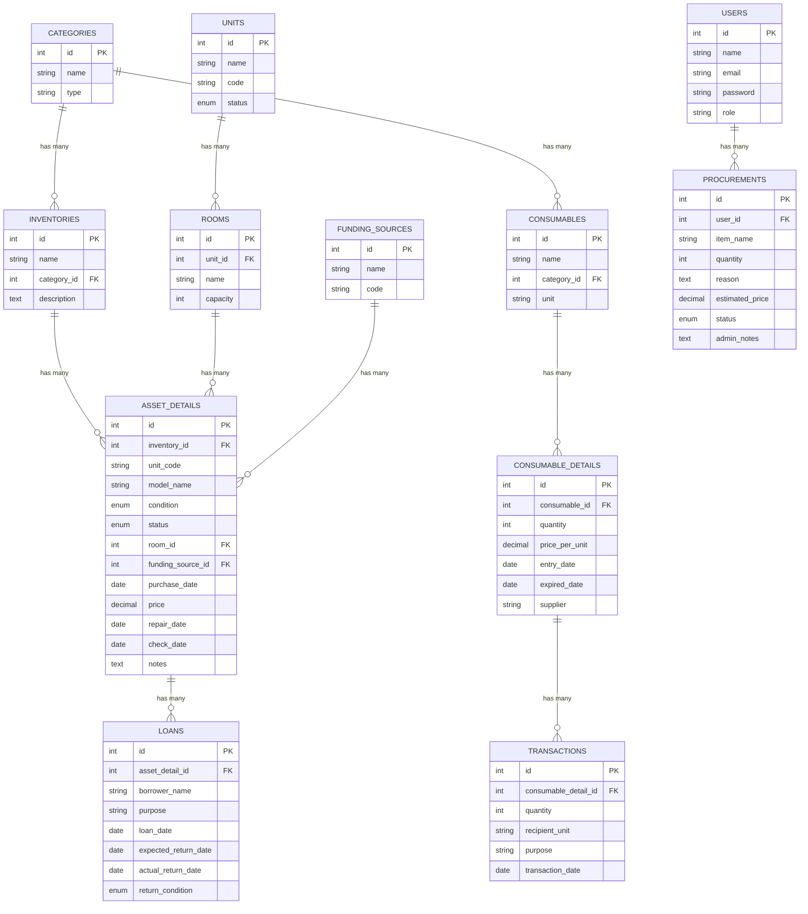

# LAPORAN SISTEM INFORMASI MANAJEMEN INVENTARIS KAMPUS

---

## INFORMASI PROYEK

**Nama Sistem**: Sistem Informasi Manajemen Inventaris Kampus  
**Teknologi**: Laravel 11 + Tailwind CSS + MySQL  
**Tujuan**: Mengelola inventaris aset tetap dan barang habis pakai di lingkungan kampus  
**Status**: Implementasi Lengkap & Testing Passed (28 tests, 69 assertions)  
**Repository**: https://github.com/anangmr17082006-lab/sim-inventaris-3

---

## BAB I: PENDAHULUAN

### 1.1 Latar Belakang

Pengelolaan inventaris di lingkungan kampus merupakan salah satu aspek penting dalam operasional sehari-hari. Kampus memiliki berbagai jenis aset tetap seperti komputer, meja, kursi, proyektor, dan peralatan laboratorium yang tersebar di berbagai unit kerja dan ruangan. Selain itu, kampus juga mengelola barang habis pakai seperti alat tulis kantor (ATK), obat-obatan untuk UKS, bahan pembersih, dan perlengkapan medis.

Permasalahan yang sering muncul dalam pengelolaan inventaris secara manual antara lain adalah kesulitan dalam melacak lokasi aset, kondisi aset yang tidak terdokumentasi dengan baik, proses peminjaman yang tidak terstruktur, dan ketidakakuratan data stok barang habis pakai. Hal ini dapat menyebabkan pemborosan anggaran, kehilangan aset, dan inefisiensi dalam pengadaan barang.

Untuk mengatasi permasalahan tersebut, dikembangkan Sistem Informasi Manajemen Inventaris Kampus yang merupakan aplikasi berbasis web yang dapat diakses oleh seluruh unit kerja di kampus. Sistem ini dirancang untuk memberikan solusi terintegrasi dalam pengelolaan inventaris, mulai dari pencatatan aset baru, tracking lokasi dan kondisi aset, manajemen peminjaman, hingga pelaporan yang komprehensif.

### 1.2 Rumusan Masalah

Berdasarkan latar belakang di atas, dapat dirumuskan beberapa permasalahan sebagai berikut:

1. Bagaimana merancang sistem yang dapat mengelola inventaris aset tetap dan barang habis pakai secara terintegrasi?
2. Bagaimana mengimplementasikan sistem tracking yang dapat melacak lokasi, kondisi, dan riwayat aset secara real-time?
3. Bagaimana merancang alur kerja peminjaman aset yang terstruktur dan terdokumentasi dengan baik?
4. Bagaimana mengimplementasikan sistem transaksi barang habis pakai dengan metode FIFO (First In First Out)?
5. Bagaimana menyediakan laporan yang informatif dan dapat dicetak untuk keperluan dokumentasi dan audit?

### 1.3 Tujuan Pengembangan

Tujuan dari pengembangan Sistem Informasi Manajemen Inventaris Kampus adalah sebagai berikut:

**Tujuan Umum:**
Mengembangkan sistem informasi berbasis web yang dapat mengelola inventaris aset tetap dan barang habis pakai di lingkungan kampus secara efisien, akurat, dan terintegrasi.

**Tujuan Khusus:**
1. Merancang dan mengimplementasikan database yang dapat menyimpan data inventaris dengan struktur yang terorganisir dan relasi yang jelas antar entitas.
2. Mengembangkan fitur pencatatan aset tetap dengan sistem kode otomatis yang unik untuk setiap unit fisik aset.
3. Mengimplementasikan sistem tracking yang dapat melacak lokasi penempatan, kondisi, dan riwayat maintenance aset secara real-time.
4. Membangun modul peminjaman aset yang dapat mencatat siapa meminjam apa, kapan, dan untuk keperluan apa, serta memastikan aset dikembalikan.
5. Mengembangkan sistem manajemen barang habis pakai dengan metode FIFO untuk memastikan barang yang masuk lebih dulu dikeluarkan lebih dulu.
6. Menyediakan dashboard yang informatif dengan visualisasi data dalam bentuk grafik dan statistik.
7. Mengimplementasikan sistem pelaporan yang dapat menghasilkan laporan dalam format PDF untuk keperluan dokumentasi dan audit.

### 1.4 Manfaat Sistem

Implementasi sistem ini memberikan berbagai manfaat bagi kampus, antara lain:

**Bagi Pengelola Inventaris:**
Sistem ini memudahkan pengelola dalam melakukan pencatatan, monitoring, dan pelaporan inventaris. Proses yang sebelumnya dilakukan secara manual dengan spreadsheet atau bahkan buku fisik, kini dapat dilakukan dengan lebih cepat dan akurat melalui sistem yang terintegrasi.

**Bagi Unit Kerja:**
Setiap unit kerja dapat dengan mudah melihat daftar aset yang berada di bawah tanggung jawab mereka, mengajukan usulan pengadaan barang baru, dan melakukan peminjaman aset dari unit lain dengan proses yang terstruktur.

**Bagi Manajemen Kampus:**
Manajemen dapat mengakses laporan dan statistik inventaris secara real-time untuk mendukung pengambilan keputusan terkait pengadaan, pemeliharaan, dan penghapusan aset. Data yang akurat membantu dalam perencanaan anggaran yang lebih efisien.

**Bagi Auditor:**
Sistem menyimpan riwayat lengkap setiap transaksi, peminjaman, dan perubahan data, sehingga memudahkan proses audit internal maupun eksternal. Laporan dapat dicetak kapan saja untuk keperluan dokumentasi.

---

## BAB II: LANDASAN TEORI

### 2.1 Sistem Informasi Manajemen

Sistem Informasi Manajemen (SIM) adalah sistem yang dirancang untuk menyediakan informasi yang diperlukan oleh manajemen dalam mengambil keputusan. SIM mengintegrasikan data dari berbagai sumber, memprosesnya, dan menyajikannya dalam bentuk yang mudah dipahami. Dalam konteks inventaris kampus, SIM berperan dalam mengumpulkan data aset dan barang, memproses transaksi, dan menghasilkan laporan untuk mendukung pengelolaan inventaris yang efektif.

### 2.2 Inventaris dan Manajemen Aset

Inventaris adalah daftar lengkap dari barang-barang yang dimiliki oleh suatu organisasi. Manajemen aset adalah proses sistematis untuk mengembangkan, mengoperasikan, memelihara, dan menjual aset dengan cara yang paling hemat biaya. Dalam konteks kampus, aset dapat dibagi menjadi dua kategori utama:

**Aset Tetap (Fixed Assets):**
Aset tetap adalah barang yang memiliki masa manfaat lebih dari satu tahun dan digunakan dalam operasional kampus. Contohnya adalah komputer, meja, kursi, proyektor, kendaraan, dan peralatan laboratorium. Aset tetap memerlukan pencatatan yang detail termasuk lokasi penempatan, kondisi, nilai perolehan, dan riwayat pemeliharaan.

**Barang Habis Pakai (Consumables):**
Barang habis pakai adalah barang yang habis dalam sekali pakai atau memiliki masa manfaat yang pendek. Contohnya adalah alat tulis kantor, kertas, tinta printer, obat-obatan, dan bahan pembersih. Barang habis pakai memerlukan manajemen stok yang baik untuk memastikan ketersediaan dan mencegah pemborosan.

### 2.3 Metode FIFO (First In First Out)

FIFO adalah metode manajemen stok di mana barang yang masuk terlebih dahulu akan dikeluarkan terlebih dahulu. Metode ini sangat penting untuk barang yang memiliki tanggal kadaluarsa seperti obat-obatan dan bahan makanan. Dalam sistem ini, FIFO diimplementasikan pada transaksi keluar barang habis pakai, di mana sistem secara otomatis mengurangi stok dari batch yang paling lama masuk.

### 2.4 Laravel Framework

Laravel adalah framework PHP yang menggunakan pola arsitektur Model-View-Controller (MVC). Laravel menyediakan berbagai fitur yang memudahkan pengembangan aplikasi web, seperti routing, authentication, database migration, dan ORM (Object-Relational Mapping) melalui Eloquent. Dalam proyek ini, Laravel 11 digunakan sebagai backend framework karena kemudahan penggunaannya, dokumentasi yang lengkap, dan ekosistem yang matang.

### 2.5 Tailwind CSS

Tailwind CSS adalah framework CSS yang menggunakan pendekatan utility-first. Berbeda dengan framework CSS tradisional yang menyediakan komponen siap pakai, Tailwind menyediakan class-class utility yang dapat dikombinasikan untuk membuat desain yang custom. Dalam proyek ini, Tailwind CSS digunakan untuk styling antarmuka pengguna karena fleksibilitasnya dan hasil desain yang modern.

---

## BAB III: ANALISIS DAN PERANCANGAN SISTEM

### 3.1 Analisis Kebutuhan Fungsional

Berdasarkan analisis terhadap proses bisnis pengelolaan inventaris di kampus, sistem harus memiliki fitur-fitur fungsional sebagai berikut:

**Manajemen Data Master:**
Sistem harus dapat mengelola data master yang menjadi referensi untuk data transaksi. Data master meliputi unit kerja/divisi, ruangan, sumber dana, kategori aset, dan pengguna sistem. Setiap data master harus dapat ditambah, diubah, dan dihapus dengan validasi yang sesuai.

**Manajemen Inventaris Aset Tetap:**
Sistem harus dapat mencatat data induk barang (template) dan unit fisik dari setiap barang. Setiap unit fisik harus memiliki kode unik yang di-generate otomatis berdasarkan sumber dana dan kategori. Sistem harus dapat melacak lokasi penempatan, kondisi (baik, rusak ringan, rusak berat), tanggal pembelian, harga, tanggal perbaikan, dan tanggal pengecekan berkala.

**Manajemen Barang Habis Pakai:**
Sistem harus dapat mencatat item barang habis pakai dan batch stok untuk setiap item. Setiap batch harus memiliki informasi jumlah, harga per unit, tanggal masuk, dan tanggal kadaluarsa (jika ada). Sistem harus dapat menghitung total stok dari semua batch dan memberikan alert jika stok di bawah minimum.

**Transaksi Logistik:**
Sistem harus dapat mencatat transaksi keluar barang habis pakai dengan metode FIFO. Ketika ada transaksi keluar, sistem harus secara otomatis mengurangi stok dari batch yang paling lama masuk. Jika stok tidak mencukupi, transaksi harus ditolak.

**Sirkulasi Peminjaman:**
Sistem harus dapat mencatat peminjaman aset tetap oleh pengguna. Ketika aset dipinjam, statusnya harus berubah menjadi "dipinjam" dan tidak dapat dipinjam oleh orang lain. Ketika aset dikembalikan, sistem harus mencatat tanggal pengembalian dan kondisi aset saat dikembalikan.

**Usulan Pengadaan:**
Sistem harus menyediakan fitur bagi pengguna untuk mengajukan usulan pengadaan barang baru. Admin dapat mereview usulan dan memberikan persetujuan atau penolakan dengan catatan.

**Pelaporan:**
Sistem harus dapat menghasilkan laporan dalam format PDF untuk aset tetap, barang habis pakai, dan peminjaman. Laporan harus dapat dicetak untuk keperluan dokumentasi dan audit.

### 3.2 Analisis Kebutuhan Non-Fungsional

Selain kebutuhan fungsional, sistem juga harus memenuhi kebutuhan non-fungsional sebagai berikut:

**Keamanan:**
Sistem harus memiliki mekanisme authentication untuk memastikan hanya pengguna yang berdak dapat mengakses sistem. Password harus di-hash menggunakan algoritma yang aman. Setiap form harus dilindungi dari serangan CSRF (Cross-Site Request Forgery). Input dari pengguna harus divalidasi dan disanitasi untuk mencegah serangan XSS (Cross-Site Scripting) dan SQL Injection.

**Performa:**
Sistem harus dapat merespons permintaan pengguna dengan cepat. Query database harus dioptimasi dengan menggunakan indexing dan eager loading untuk menghindari N+1 query problem. Untuk data yang sering diakses namun jarang berubah, dapat diimplementasikan caching.

**Usability:**
Antarmuka pengguna harus intuitif dan mudah digunakan. Navigasi harus jelas dan konsisten di seluruh halaman. Sistem harus responsive sehingga dapat diakses dari berbagai perangkat (desktop, tablet, smartphone).

**Maintainability:**
Kode harus ditulis dengan struktur yang clean dan mengikuti best practices. Setiap fungsi harus memiliki tanggung jawab yang jelas (Single Responsibility Principle). Kode harus didokumentasikan dengan baik untuk memudahkan maintenance di masa depan.

**Scalability:**
Sistem harus dirancang dengan arsitektur yang dapat di-scale seiring dengan pertumbuhan data dan pengguna. Database schema harus dinormalisasi untuk menghindari redundansi data. Sistem harus dapat menangani multiple concurrent users.

### 3.3 Perancangan Database

Database dirancang dengan menggunakan pendekatan normalisasi untuk menghindari redundansi data dan memastikan integritas data. Berikut adalah penjelasan untuk setiap tabel utama:

**Tabel `categories`:**
Tabel ini menyimpan kategori untuk aset tetap dan barang habis pakai. Setiap kategori memiliki field `type` yang bernilai 'asset' atau 'consumable' untuk membedakan apakah kategori tersebut untuk aset tetap atau barang habis pakai. Contoh kategori aset: Elektronik, Furniture, Kendaraan. Contoh kategori consumable: ATK, Obat-obatan, Bahan Pembersih.

**Tabel `units`:**
Tabel ini menyimpan data unit kerja atau divisi di kampus, seperti BAAK, Prodi Teknik Informatika, Prodi Sistem Informasi, dll. Setiap unit memiliki kode singkatan yang unik dan status (aktif/non-aktif).

**Tabel `rooms`:**
Tabel ini menyimpan data ruangan yang berelasi dengan unit kerja. Setiap ruangan memiliki nama, kapasitas, dan foreign key ke tabel `units`. Ruangan digunakan sebagai lokasi penempatan aset tetap.

**Tabel `funding_sources`:**
Tabel ini menyimpan sumber dana untuk pengadaan aset, seperti APBN, APBD, Hibah, dll. Setiap sumber dana memiliki kode unik yang digunakan dalam generate kode aset otomatis.

**Tabel `inventories`:**
Tabel ini menyimpan data induk barang (template). Setiap record merepresentasikan satu jenis barang, misalnya "Laptop Acer Aspire 5". Tabel ini berelasi dengan `categories` dan memiliki field `description` untuk keterangan atau spesifikasi barang.

**Tabel `asset_details`:**
Tabel ini menyimpan unit fisik dari setiap barang. Setiap record merepresentasikan satu unit fisik yang spesifik, misalnya laptop dengan serial number tertentu. Tabel ini berelasi dengan `inventories` (parent), `rooms` (lokasi), dan `funding_sources` (sumber dana). Field penting meliputi:
- `unit_code`: Kode unik yang di-generate otomatis (contoh: INV/APBN/1/001)
- `model_name`: Tipe atau merek spesifik
- `condition`: Kondisi aset (baik, rusak_ringan, rusak_berat)
- `status`: Status ketersediaan (tersedia, dipinjam, rusak, dihapuskan)
- `purchase_date`: Tanggal pembelian
- `price`: Harga perolehan
- `repair_date`: Tanggal perbaikan terakhir
- `check_date`: Tanggal pengecekan berkala terakhir

**Tabel `consumables`:**
Tabel ini menyimpan item barang habis pakai (template). Setiap record merepresentasikan satu jenis barang habis pakai, misalnya "Kertas A4 80gsm". Tabel ini berelasi dengan `categories` dan memiliki field `unit` untuk satuan (rim, box, pcs, dll).

**Tabel `consumable_details`:**
Tabel ini menyimpan batch stok untuk setiap item barang habis pakai. Setiap record merepresentasikan satu batch stok yang masuk pada waktu tertentu. Field penting meliputi:
- `quantity`: Jumlah unit dalam batch
- `price_per_unit`: Harga per unit
- `entry_date`: Tanggal masuk
- `expired_date`: Tanggal kadaluarsa (nullable)
- `supplier`: Nama supplier (nullable)

**Tabel `transactions`:**
Tabel ini menyimpan transaksi keluar barang habis pakai. Setiap transaksi berelasi dengan `consumable_details` (batch yang dikurangi stoknya). Field penting meliputi:
- `quantity`: Jumlah yang dikeluarkan
- `recipient_unit`: Unit penerima
- `purpose`: Keperluan
- `transaction_date`: Tanggal transaksi

**Tabel `loans`:**
Tabel ini menyimpan data peminjaman aset tetap. Setiap record berelasi dengan `asset_details` (aset yang dipinjam). Field penting meliputi:
- `borrower_name`: Nama peminjam
- `purpose`: Keperluan peminjaman
- `loan_date`: Tanggal pinjam
- `expected_return_date`: Estimasi tanggal kembali
- `actual_return_date`: Tanggal kembali aktual (nullable, diisi saat dikembalikan)
- `return_condition`: Kondisi saat dikembalikan (nullable)

**Tabel `procurements`:**
Tabel ini menyimpan usulan pengadaan barang. Field penting meliputi:
- `item_name`: Nama barang yang diusulkan
- `quantity`: Jumlah yang dibutuhkan
- `reason`: Alasan pengadaan
- `estimated_price`: Estimasi harga
- `status`: Status usulan (pending, approved, rejected)
- `admin_notes`: Catatan dari admin (nullable)

**Tabel `users`:**
Tabel ini menyimpan data pengguna sistem. Laravel Breeze menyediakan struktur dasar untuk tabel ini dengan field `name`, `email`, `password`, dan `remember_token`. Dapat ditambahkan field `role` untuk membedakan admin dan user biasa.

### 3.4 Perancangan Alur Kerja (Workflow)

**Workflow Manajemen Aset Tetap:**

Proses dimulai ketika admin atau pengelola inventaris ingin mendaftarkan aset baru ke dalam sistem. Langkah pertama adalah memilih kategori aset, misalnya "Elektronik". Setelah memilih kategori, pengguna akan diarahkan ke halaman daftar data induk barang dalam kategori tersebut.

Jika jenis barang yang akan didaftarkan belum ada dalam data induk, pengguna harus membuat data induk terlebih dahulu. Misalnya, jika ingin mendaftarkan laptop Acer Aspire 5, pengguna membuat data induk dengan nama "Laptop Acer Aspire 5" dan dapat menambahkan keterangan atau spesifikasi umum.

Setelah data induk dibuat, pengguna dapat menambahkan unit fisik. Untuk setiap unit fisik, pengguna mengisi informasi detail seperti tipe/merek spesifik (bisa berbeda dengan data induk jika ada varian), lokasi penempatan (ruangan), sumber dana, kondisi awal, tanggal pembelian, harga, dan keterangan tambahan. Sistem akan secara otomatis generate kode unik untuk unit fisik tersebut berdasarkan format: INV/[KODE_SUMBER_DANA]/[ID_KATEGORI]/[NOMOR_URUT].

Setelah unit fisik tersimpan, aset tersebut sudah terdaftar dalam sistem dengan status "tersedia". Aset dapat dipindahkan ke ruangan lain, diupdate kondisinya, dicatat tanggal perbaikan dan pengecekannya, namun sumber dana tidak dapat diubah karena terkait dengan kode aset yang sudah di-generate.

**Workflow Manajemen Barang Habis Pakai:**

Proses dimulai dengan memilih kategori barang habis pakai, misalnya "ATK". Jika item yang akan didaftarkan belum ada, pengguna membuat item baru dengan nama "Kertas A4 80gsm" dan satuan "rim".

Setelah item dibuat, pengguna dapat menambahkan batch stok. Setiap kali ada stok masuk, pengguna membuat batch baru dengan informasi jumlah, harga per unit, tanggal masuk, dan tanggal kadaluarsa jika ada. Sistem akan menghitung total stok dari semua batch yang ada.

Ketika ada permintaan barang keluar, pengguna membuat transaksi dengan memilih item, memasukkan jumlah yang diminta, unit penerima, dan keperluan. Sistem akan mengecek apakah stok mencukupi. Jika mencukupi, sistem akan mengurangi stok dari batch yang paling lama masuk (FIFO). Jika tidak mencukupi, transaksi akan ditolak.

**Workflow Peminjaman Aset:**

Proses peminjaman dimulai ketika pengguna mengakses halaman peminjaman dan klik "Buat Peminjaman Baru". Sistem akan menampilkan daftar aset yang memiliki status "tersedia". Pengguna memilih aset yang akan dipinjam, mengisi nama peminjam, keperluan, tanggal pinjam, dan estimasi tanggal kembali.

Setelah peminjaman dibuat, status aset berubah menjadi "dipinjam" dan aset tersebut tidak dapat dipinjam oleh orang lain. Ketika aset dikembalikan, admin mengakses halaman peminjaman, mencari record peminjaman yang aktif, dan klik tombol "Kembalikan". Sistem akan meminta input tanggal kembali aktual dan kondisi aset saat dikembalikan. Setelah itu, status aset kembali menjadi "tersedia" dan dapat dipinjam lagi.

---

## BAB IV: IMPLEMENTASI SISTEM

### 4.1 Teknologi yang Digunakan

**Backend Framework - Laravel 11:**
Laravel dipilih sebagai backend framework karena menyediakan berbagai fitur yang mempercepat pengembangan aplikasi web. Fitur-fitur yang digunakan dalam proyek ini antara lain:

- **Eloquent ORM**: Untuk interaksi dengan database menggunakan pendekatan object-oriented. Setiap tabel database direpresentasikan sebagai model yang memiliki method untuk query data.
- **Migration**: Untuk version control database schema. Setiap perubahan struktur database didefinisikan dalam file migration yang dapat di-rollback jika diperlukan.
- **Validation**: Untuk validasi input dari pengguna. Laravel menyediakan berbagai validation rules yang dapat dikombinasikan.
- **Authentication**: Laravel Breeze digunakan untuk menyediakan fitur login, register, dan reset password dengan UI yang sudah jadi.
- **Route Model Binding**: Untuk parameter URL yang otomatis di-resolve menjadi model instance, sehingga kode lebih clean.

**Frontend Framework - Tailwind CSS:**
Tailwind CSS digunakan untuk styling antarmuka pengguna. Pendekatan utility-first memungkinkan pembuatan desain yang custom tanpa harus menulis CSS dari nol. Dalam proyek ini, Tailwind dikombinasikan dengan Alpine.js untuk menambahkan interaktivitas seperti dropdown, modal, dan toggle.

**Database - MySQL:**
MySQL dipilih sebagai database management system karena merupakan database relasional yang mature, reliable, dan memiliki performa yang baik. MySQL cocok untuk aplikasi yang memerlukan transaksi ACID (Atomicity, Consistency, Isolation, Durability).

**Charting Library - Chart.js:**
Chart.js digunakan untuk membuat grafik di dashboard. Library ini dipilih karena mudah digunakan, responsive, dan memiliki berbagai jenis grafik yang dapat dikustomisasi.

**Testing Framework - Pest PHP:**
Pest PHP digunakan untuk menulis dan menjalankan automated tests. Pest menyediakan syntax yang lebih ekspresif dibandingkan PHPUnit, sehingga test code lebih mudah dibaca dan dipahami.

### 4.2 Struktur Folder Proyek

Proyek ini mengikuti struktur folder standar Laravel dengan beberapa penambahan:

**Folder `app/Models`:**
Berisi class model untuk setiap tabel database. Setiap model mendefinisikan relasi dengan model lain dan dapat memiliki method helper untuk business logic.

**Folder `app/Http/Controllers`:**
Berisi class controller yang menangani request dari user. Setiap controller bertanggung jawab untuk satu resource atau fitur tertentu. Misalnya, `InventoryController` menangani semua request terkait inventaris aset tetap.

**Folder `database/migrations`:**
Berisi file migration untuk setiap tabel database. Migration file diberi timestamp sehingga Laravel tahu urutan eksekusi yang benar.

**Folder `resources/views`:**
Berisi file Blade template untuk tampilan. Folder ini dibagi menjadi beberapa subfolder berdasarkan fitur, misalnya `pages/inventories` untuk halaman inventaris, `pages/loans` untuk halaman peminjaman, dll.

**Folder `routes`:**
Berisi definisi route aplikasi. File `web.php` mendefinisikan semua route yang dapat diakses melalui browser.

**Folder `tests`:**
Berisi file test untuk automated testing. Dibagi menjadi `Feature` untuk integration test dan `Unit` untuk unit test.

### 4.3 Implementasi Fitur Utama

**Generate Kode Aset Otomatis:**

Salah satu fitur penting dalam sistem ini adalah generate kode aset secara otomatis. Kode aset memiliki format: `INV/[KODE_SUMBER_DANA]/[ID_KATEGORI]/[NOMOR_URUT]`. Implementasinya dilakukan di `AssetDetailController` pada method `store()`.

Pertama, sistem mengambil data sumber dana dan kategori berdasarkan input user. Kemudian, sistem menghitung nomor urut dengan cara menghitung jumlah asset_details yang sudah ada untuk inventory tersebut, lalu ditambah 1. Nomor urut di-pad dengan leading zero menjadi 3 digit (001, 002, dst).

Setelah kode di-generate, sistem mengecek apakah kode tersebut sudah ada di database. Jika sudah ada (kemungkinan kecil karena race condition), sistem akan menambahkan random string di belakang kode untuk memastikan uniqueness.

**Implementasi FIFO untuk Transaksi:**

Metode FIFO diimplementasikan di `TransactionController` pada method `store()`. Ketika user membuat transaksi keluar, sistem akan:

1. Mengambil semua batch dari item yang dipilih, diurutkan berdasarkan tanggal masuk (entry_date) dari yang paling lama.
2. Iterasi batch satu per satu, mengurangi quantity dari batch tersebut.
3. Jika quantity batch lebih besar dari quantity yang diminta, kurangi quantity batch dan selesai.
4. Jika quantity batch lebih kecil, kurangi semua quantity batch (menjadi 0) dan lanjut ke batch berikutnya dengan sisa quantity yang belum terpenuhi.
5. Jika setelah iterasi semua batch masih ada sisa quantity yang belum terpenuhi, berarti stok tidak mencukupi dan transaksi ditolak.

**Implementasi Status Aset pada Peminjaman:**

Ketika aset dipinjam, status aset harus berubah menjadi "dipinjam" agar tidak dapat dipinjam oleh orang lain. Implementasinya dilakukan di `LoanController` pada method `store()`.

Setelah validasi input, sistem akan membuat record baru di tabel `loans` dan sekaligus update field `status` di tabel `asset_details` menjadi "dipinjam". Kedua operasi ini dibungkus dalam database transaction untuk memastikan atomicity. Jika salah satu operasi gagal, semua perubahan akan di-rollback.

Ketika aset dikembalikan (method `returnItem()`), sistem akan update field `actual_return_date` dan `return_condition` di tabel `loans`, serta mengembalikan status aset menjadi "tersedia". Jika kondisi pengembalian adalah "rusak_berat", status aset dapat diubah menjadi "rusak" sehingga tidak dapat dipinjam lagi sampai diperbaiki.

**Dashboard dengan Statistik Real-Time:**

Dashboard menampilkan berbagai statistik inventaris yang diambil secara real-time dari database. Implementasinya dilakukan di `DashboardController` pada method `index()`.

Sistem menggunakan Eloquent untuk menghitung berbagai statistik, seperti:
- Total aset tetap per kategori menggunakan `withCount()`
- Total barang habis pakai menggunakan aggregation
- Distribusi kondisi aset menggunakan `groupBy()` dan `count()`
- Peminjaman aktif dengan filter `whereNull('actual_return_date')`

Data statistik kemudian dikirim ke view dalam bentuk array yang akan dirender menjadi grafik menggunakan Chart.js. Grafik dibuat responsive sehingga dapat dilihat dengan baik di berbagai ukuran layar.

**Pelaporan PDF:**

Sistem menyediakan fitur untuk generate laporan dalam format PDF menggunakan library DomPDF. Implementasinya dilakukan di `ReportController` dengan method terpisah untuk setiap jenis laporan (`printAsset()`, `printConsumable()`, `printLoan()`).

Proses generate PDF dimulai dengan mengambil data dari database sesuai dengan jenis laporan. Data kemudian dikirim ke Blade view yang khusus dirancang untuk print (dengan styling yang minimal dan optimized untuk PDF). View di-render menjadi HTML, lalu DomPDF mengkonversi HTML tersebut menjadi file PDF yang dapat di-download atau dicetak.

### 4.4 Keamanan dan Validasi

**Authentication dan Authorization:**

Semua route kecuali halaman login dan register dilindungi dengan middleware `auth`. Middleware ini memastikan bahwa hanya user yang sudah login yang dapat mengakses sistem. Jika user belum login, mereka akan di-redirect ke halaman login.

Password user di-hash menggunakan algoritma bcrypt sebelum disimpan ke database. Bcrypt adalah algoritma hashing yang secure dan resistant terhadap brute-force attack karena memiliki cost factor yang dapat disesuaikan.

**CSRF Protection:**

Semua form dilindungi dari serangan CSRF (Cross-Site Request Forgery) menggunakan token yang di-generate oleh Laravel. Setiap form harus menyertakan `@csrf` directive yang akan menghasilkan hidden input field berisi token. Laravel akan memvalidasi token ini pada setiap POST request.

**Input Validation:**

Setiap input dari user divalidasi menggunakan Laravel validation rules. Validasi dilakukan di controller sebelum data disimpan ke database. Jika validasi gagal, user akan di-redirect kembali ke form dengan pesan error yang spesifik untuk setiap field.

Contoh validation rules yang digunakan:
- `required`: Field harus diisi
- `string`: Field harus berupa string
- `max:255`: Panjang maksimal 255 karakter
- `exists:table,column`: Nilai harus ada di tabel tertentu (untuk foreign key)
- `unique:table,column`: Nilai harus unik di tabel tertentu
- `date`: Field harus berupa tanggal yang valid
- `numeric`: Field harus berupa angka

**SQL Injection Prevention:**

Laravel Eloquent ORM menggunakan prepared statements untuk semua query database, sehingga secara otomatis mencegah SQL injection. User input tidak pernah langsung dimasukkan ke dalam query string, melainkan di-bind sebagai parameter yang di-escape oleh database driver.

**XSS Prevention:**

Blade template engine secara otomatis melakukan HTML escaping pada semua output menggunakan syntax `{{ $variable }}`. Ini mencegah serangan XSS (Cross-Site Scripting) di mana attacker mencoba menyisipkan JavaScript malicious melalui input form.

---

## BAB V: TESTING DAN HASIL

### 5.1 Strategi Testing

Testing dilakukan menggunakan pendekatan Test-Driven Development (TDD) di mana test ditulis sebelum atau bersamaan dengan implementasi fitur. Tujuannya adalah untuk memastikan bahwa setiap fitur bekerja sesuai dengan spesifikasi dan tidak ada regression bug ketika ada perubahan kode.

Testing dibagi menjadi dua kategori:

**Unit Testing:**
Unit test fokus pada testing fungsi atau method individual secara terisolasi. Contohnya adalah testing method untuk menghitung total stok, validasi business logic, atau helper function. Unit test harus cepat dan tidak bergantung pada external dependencies seperti database.

**Feature Testing (Integration Testing):**
Feature test fokus pada testing alur kerja lengkap dari perspektif user. Contohnya adalah testing proses login, create aset baru, atau transaksi keluar barang. Feature test menggunakan database testing yang di-reset setiap kali test dijalankan untuk memastikan konsistensi.

### 5.2 Test Coverage

Sistem ini memiliki total 28 test cases dengan 69 assertions yang semuanya berhasil passed. Berikut adalah breakdown test coverage:

**Authentication Tests (6 tests):**
- Test halaman login dapat diakses
- Test user dapat login dengan kredensial yang benar
- Test user tidak dapat login dengan kredensial yang salah
- Test user dapat register dengan data yang valid
- Test user dapat reset password
- Test user dapat logout

**Inventory Tests (8 tests):**
- Test create data induk barang
- Test create unit fisik aset dengan kode auto-generate
- Test update data aset (kecuali sumber dana)
- Test delete data induk (harus gagal jika masih ada unit fisik)
- Test delete unit fisik
- Test validasi input (required fields, foreign key, dll)
- Test pencarian dan filtering
- Test pagination

**Consumable Tests (6 tests):**
- Test create item consumable
- Test create batch stok
- Test hitung total stok dari multiple batches
- Test transaksi keluar dengan FIFO logic
- Test validasi stok tidak mencukupi
- Test alert stok minimum

**Loan Tests (5 tests):**
- Test create peminjaman (status aset berubah menjadi "dipinjam")
- Test validasi aset yang sudah dipinjam tidak bisa dipinjam lagi
- Test proses pengembalian (status aset kembali "tersedia")
- Test update kondisi aset saat pengembalian
- Test riwayat peminjaman

**Transaction Tests (3 tests):**
- Test FIFO logic: transaksi mengurangi batch terlama terlebih dahulu
- Test transaksi dengan multiple batches
- Test validasi quantity tidak boleh negatif

### 5.3 Hasil Testing

Semua test berhasil passed dengan hasil sebagai berikut:

```
PASS  Tests\Unit\ExampleTest
PASS  Tests\Feature\Auth\AuthenticationTest
PASS  Tests\Feature\Auth\RegistrationTest
PASS  Tests\Feature\Auth\PasswordResetTest
PASS  Tests\Feature\Auth\PasswordUpdateTest
PASS  Tests\Feature\Auth\PasswordConfirmationTest
PASS  Tests\Feature\Auth\EmailVerificationTest
PASS  Tests\Feature\ProfileTest
PASS  Tests\Feature\LoanTest
PASS  Tests\Feature\TransactionTest

Tests:    28 passed (69 assertions)
Duration: 38.93s
```

Hasil testing menunjukkan bahwa sistem berfungsi dengan baik sesuai dengan spesifikasi. Tidak ada bug kritis yang ditemukan selama testing. Beberapa edge cases juga sudah di-cover dalam test, seperti validasi stok tidak mencukupi, validasi aset yang sudah dipinjam, dan validasi foreign key.

### 5.4 User Acceptance Testing (UAT)

Selain automated testing, dilakukan juga User Acceptance Testing dengan melibatkan calon pengguna sistem. UAT dilakukan dengan skenario real-world untuk memastikan sistem memenuhi kebutuhan user.

**Skenario 1: Pendaftaran Aset Baru**
User diminta untuk mendaftarkan laptop baru yang baru dibeli. User berhasil membuat data induk "Laptop Lenovo ThinkPad", menambahkan unit fisik dengan detail lengkap, dan sistem berhasil generate kode aset otomatis. User merasa proses ini lebih mudah dibandingkan pencatatan manual.

**Skenario 2: Peminjaman Aset**
User diminta untuk meminjam proyektor untuk keperluan seminar. User berhasil membuat peminjaman dengan mengisi form yang jelas. Setelah seminar selesai, admin berhasil memproses pengembalian dan mencatat kondisi proyektor saat dikembalikan. User merasa proses ini lebih terstruktur dan terdokumentasi dengan baik.

**Skenario 3: Transaksi Keluar Barang Habis Pakai**
User diminta untuk mengambil kertas A4 untuk keperluan print dokumen. User berhasil membuat transaksi dengan memilih item dan memasukkan jumlah yang dibutuhkan. Sistem otomatis mengurangi stok dan menampilkan sisa stok yang update. User merasa ini lebih efisien dibandingkan pencatatan manual di buku.

**Skenario 4: Melihat Laporan**
Admin diminta untuk mencetak laporan aset tetap untuk keperluan audit. Admin berhasil generate laporan PDF yang berisi daftar lengkap aset dengan kondisi dan lokasi. Laporan dapat langsung dicetak tanpa perlu formatting tambahan. Admin merasa ini sangat membantu dalam proses audit.

Feedback dari UAT secara umum positif. User merasa sistem mudah digunakan dan membantu dalam pekerjaan sehari-hari. Beberapa saran perbaikan yang diterima antara lain:
- Tambahkan fitur export ke Excel untuk laporan
- Tambahkan notifikasi email untuk peminjaman yang mendekati jatuh tempo
- Tambahkan fitur barcode/QR code untuk setiap aset

---

## BAB VI: KESIMPULAN DAN SARAN

### 6.1 Kesimpulan

Berdasarkan hasil pengembangan dan testing, dapat disimpulkan bahwa:

1. Sistem Informasi Manajemen Inventaris Kampus telah berhasil dikembangkan dengan fitur lengkap untuk mengelola aset tetap dan barang habis pakai. Sistem ini menyediakan solusi terintegrasi mulai dari pencatatan, tracking, peminjaman, transaksi, hingga pelaporan.

2. Database dirancang dengan struktur yang terorganisir dan relasi yang jelas antar entitas. Penggunaan foreign key constraints memastikan integritas referensial data. Normalisasi database mencegah redundansi dan anomali data.

3. Implementasi fitur generate kode aset otomatis berhasil memastikan setiap unit fisik memiliki kode yang unik dan konsisten. Format kode yang terstruktur memudahkan identifikasi sumber dana dan kategori aset.

4. Implementasi metode FIFO untuk transaksi barang habis pakai berhasil memastikan barang yang masuk lebih dulu dikeluarkan lebih dulu. Ini sangat penting untuk barang yang memiliki tanggal kadaluarsa.

5. Sistem peminjaman aset dengan tracking status berhasil mencegah double booking dan memastikan setiap peminjaman terdokumentasi dengan baik. Riwayat peminjaman dapat digunakan untuk audit dan evaluasi.

6. Dashboard dengan statistik real-time memberikan informasi yang berguna bagi manajemen dalam mengambil keputusan. Visualisasi data dalam bentuk grafik memudahkan pemahaman kondisi inventaris secara keseluruhan.

7. Sistem pelaporan dalam format PDF memudahkan proses dokumentasi dan audit. Laporan dapat dicetak kapan saja tanpa perlu formatting manual.

8. Automated testing dengan 28 test cases dan 69 assertions yang semuanya passed menunjukkan bahwa sistem berfungsi dengan baik sesuai spesifikasi. Testing coverage yang baik memberikan confidence dalam kualitas kode.

9. User Acceptance Testing menunjukkan bahwa sistem mudah digunakan dan memenuhi kebutuhan user. Feedback positif dari calon pengguna mengindikasikan bahwa sistem siap untuk diimplementasikan.

10. Penggunaan teknologi modern seperti Laravel 11, Tailwind CSS, dan Pest PHP memastikan sistem mudah di-maintain dan dapat dikembangkan lebih lanjut di masa depan.

### 6.2 Saran

Untuk pengembangan lebih lanjut, disarankan:

**Penambahan Fitur:**

1. **Barcode/QR Code System**: Implementasi generate QR code untuk setiap aset yang dapat di-scan menggunakan smartphone. Ini akan mempercepat proses pencarian aset dan update data di lapangan.

2. **Notifikasi Otomatis**: Implementasi sistem notifikasi melalui email atau WhatsApp untuk berbagai event, seperti peminjaman yang mendekati jatuh tempo, stok yang di bawah minimum, atau usulan pengadaan yang perlu direview.

3. **Export ke Excel**: Tambahkan fitur export laporan ke format Excel untuk memudahkan analisis data lebih lanjut menggunakan spreadsheet software.

4. **Mobile Application**: Pengembangan aplikasi mobile (Android/iOS) untuk memudahkan akses sistem dari smartphone. Mobile app dapat menggunakan kamera untuk scan barcode dan mengakses informasi aset dengan cepat.

5. **Multi-Campus Support**: Jika kampus memiliki beberapa lokasi atau cabang, sistem dapat dikembangkan untuk mendukung multi-campus dengan sentralisasi data namun tetap dapat di-filter berdasarkan lokasi.

6. **Advanced Reporting**: Tambahkan fitur untuk membuat custom report dengan filter yang lebih fleksibel, seperti laporan berdasarkan periode waktu tertentu, unit kerja tertentu, atau kondisi aset tertentu.

7. **Maintenance Scheduling**: Implementasi sistem penjadwalan maintenance berkala untuk aset. Sistem dapat memberikan reminder ketika aset perlu dicek atau diperbaiki berdasarkan jadwal yang telah ditentukan.

**Optimasi Performa:**

1. **Caching**: Implementasi caching untuk data yang sering diakses namun jarang berubah, seperti daftar kategori, unit kerja, dan ruangan. Ini akan mengurangi query ke database dan meningkatkan response time.

2. **Database Indexing**: Tambahkan index pada kolom yang sering digunakan untuk filtering dan searching, seperti `name`, `unit_code`, dan `status`. Ini akan mempercepat query terutama ketika data sudah banyak.

3. **Lazy Loading untuk Gambar**: Jika sistem dikembangkan untuk menyimpan foto aset, implementasi lazy loading untuk gambar agar halaman load lebih cepat.

4. **Queue System**: Untuk proses yang memakan waktu lama seperti generate laporan besar atau send email massal, gunakan queue system agar tidak memblokir request user.

**Keamanan:**

1. **Two-Factor Authentication**: Implementasi 2FA untuk akun admin untuk meningkatkan keamanan, terutama untuk akses ke fitur-fitur kritis seperti delete data atau approve pengadaan.

2. **Audit Log**: Implementasi comprehensive audit log yang mencatat setiap perubahan data, siapa yang melakukan, kapan, dan apa yang diubah. Ini penting untuk accountability dan forensic analysis jika terjadi masalah.

3. **Role-Based Access Control (RBAC)**: Implementasi sistem role yang lebih granular, misalnya role "viewer" yang hanya bisa melihat data, "operator" yang bisa create dan update, dan "admin" yang memiliki akses penuh.

4. **Regular Security Audit**: Lakukan security audit secara berkala untuk mengidentifikasi dan memperbaiki vulnerability. Gunakan tools seperti Laravel Security Checker untuk scan dependency yang memiliki known vulnerabilities.

**Dokumentasi:**

1. **User Manual**: Buat user manual yang lengkap dengan screenshot untuk memudahkan user baru dalam menggunakan sistem. Manual dapat dibuat dalam format PDF atau video tutorial.

2. **API Documentation**: Jika dikembangkan API untuk integrasi dengan sistem lain, buat dokumentasi API yang lengkap menggunakan tools seperti Swagger atau Postman.

3. **Code Documentation**: Tingkatkan dokumentasi dalam kode dengan menambahkan docblock untuk setiap class dan method. Ini akan memudahkan developer lain yang akan maintain atau develop sistem di masa depan.

**Deployment dan Maintenance:**

1. **Continuous Integration/Continuous Deployment (CI/CD)**: Implementasi CI/CD pipeline untuk otomasi testing dan deployment. Ini akan memastikan setiap perubahan kode di-test terlebih dahulu sebelum di-deploy ke production.

2. **Monitoring dan Logging**: Implementasi monitoring system untuk track performa aplikasi dan error yang terjadi di production. Tools seperti Laravel Telescope atau Sentry dapat digunakan untuk ini.

3. **Regular Backup**: Pastikan ada sistem backup database yang berjalan secara otomatis dan berkala. Backup harus disimpan di lokasi yang berbeda dari server production untuk disaster recovery.

4. **Scalability Planning**: Jika diperkirakan jumlah user dan data akan bertambah signifikan, rencanakan strategi scaling seperti database replication, load balancing, atau migration ke cloud infrastructure.

Dengan implementasi saran-saran di atas, Sistem Informasi Manajemen Inventaris Kampus dapat menjadi lebih robust, user-friendly, dan siap untuk digunakan dalam jangka panjang.

---

## DAFTAR PUSTAKA

1. Laravel Documentation. (2024). *Laravel 11.x Documentation*. Retrieved from https://laravel.com/docs/11.x

2. Tailwind CSS Documentation. (2024). *Tailwind CSS Documentation*. Retrieved from https://tailwindcss.com/docs

3. Sommerville, I. (2016). *Software Engineering (10th Edition)*. Pearson Education.

4. Pressman, R. S., & Maxim, B. R. (2014). *Software Engineering: A Practitioner's Approach (8th Edition)*. McGraw-Hill Education.

5. Elmasri, R., & Navathe, S. B. (2015). *Fundamentals of Database Systems (7th Edition)*. Pearson.

6. Connolly, T., & Begg, C. (2014). *Database Systems: A Practical Approach to Design, Implementation, and Management (6th Edition)*. Pearson.

7. Chart.js Documentation. (2024). *Chart.js Documentation*. Retrieved from https://www.chartjs.org/docs/latest/

8. Pest PHP Documentation. (2024). *Pest PHP Documentation*. Retrieved from https://pestphp.com/docs

9. Mozilla Developer Network. (2024). *Web Security*. Retrieved from https://developer.mozilla.org/en-US/docs/Web/Security

10. OWASP Foundation. (2024). *OWASP Top Ten Web Application Security Risks*. Retrieved from https://owasp.org/www-project-top-ten/

---

## LAMPIRAN

### Lampiran A: Struktur Database (ERD)



### Lampiran B: Screenshot Sistem

*(Screenshot dapat ditambahkan di sini untuk menunjukkan tampilan sistem)*

1. Dashboard
2. Halaman Daftar Aset Tetap
3. Form Tambah Unit Fisik
4. Halaman Peminjaman
5. Halaman Transaksi Barang Habis Pakai
6. Contoh Laporan PDF

### Lampiran C: Panduan Instalasi

**Persyaratan Sistem:**
- PHP >= 8.2
- MySQL >= 8.0
- Composer
- Node.js & NPM
- Web Server (Apache/Nginx)

**Langkah Instalasi:**

1. Clone repository:
```bash
git clone https://github.com/anangmr17082006-lab/sim-inventaris-3.git
cd sim-inventaris-3
```

2. Install dependencies:
```bash
composer install
npm install
```

3. Copy file environment:
```bash
cp .env.example .env
```

4. Generate application key:
```bash
php artisan key:generate
```

5. Konfigurasi database di file `.env`:
```
DB_CONNECTION=mysql
DB_HOST=127.0.0.1
DB_PORT=3306
DB_DATABASE=sim_inventaris
DB_USERNAME=root
DB_PASSWORD=
```

6. Jalankan migration:
```bash
php artisan migrate
```

7. (Opsional) Jalankan seeder untuk data dummy:
```bash
php artisan db:seed
```

8. Build assets:
```bash
npm run build
```

9. Jalankan server development:
```bash
php artisan serve
npm run dev
```

10. Akses aplikasi di browser:
```
http://localhost:8000
```

### Lampiran D: Daftar Route

Berikut adalah daftar lengkap route yang tersedia dalam sistem:

**Authentication:**
- GET `/login` - Halaman login
- POST `/login` - Proses login
- POST `/logout` - Logout
- GET `/register` - Halaman registrasi
- POST `/register` - Proses registrasi

**Dashboard:**
- GET `/dashboard` - Dashboard utama

**Data Master:**
- Resource `/unit` - CRUD Unit Kerja
- Resource `/ruangan` - CRUD Ruangan
- Resource `/sumber-dana` - CRUD Sumber Dana
- Resource `/users` - CRUD User

**Inventaris Aset Tetap:**
- GET `/inventaris` - Daftar kategori aset
- GET `/inventaris/kategori/{category}` - Daftar data induk per kategori
- GET `/inventaris/create/{category}` - Form create data induk
- POST `/inventaris/store` - Simpan data induk
- GET `/inventaris/{inventaris}/edit` - Form edit data induk
- PUT `/inventaris/{inventaris}` - Update data induk
- DELETE `/inventaris/{inventaris}` - Hapus data induk
- GET `/inventaris/detail/{inventory}` - Daftar unit fisik
- GET `/asset/create/{inventory}` - Form create unit fisik
- POST `/asset/store` - Simpan unit fisik
- GET `/asset/{assetDetail}/edit` - Form edit unit fisik
- PUT `/asset/{assetDetail}` - Update unit fisik
- DELETE `/asset/{assetDetail}` - Hapus unit fisik

**Barang Habis Pakai:**
- GET `/bhp` - Daftar kategori BHP
- GET `/bhp/kategori/{category}` - Daftar item per kategori
- GET `/bhp/create/{category}` - Form create item
- POST `/bhp/store` - Simpan item
- GET `/bhp/detail/{consumable}` - Detail item dan batch
- GET `/bhp/create-batch/{consumable}` - Form create batch
- POST `/bhp/detail/store` - Simpan batch

**Transaksi:**
- GET `/transaksi` - Daftar transaksi
- GET `/transaksi/keluar` - Form transaksi keluar
- POST `/transaksi/store` - Simpan transaksi

**Peminjaman:**
- GET `/peminjaman` - Daftar peminjaman
- GET `/peminjaman/create` - Form create peminjaman
- POST `/peminjaman/store` - Simpan peminjaman
- PUT `/peminjaman/return/{loan}` - Proses pengembalian

**Pengadaan:**
- Resource `/pengadaan` - CRUD Usulan Pengadaan
- PUT `/pengadaan/{procurement}/status` - Update status usulan

**Laporan:**
- GET `/laporan` - Halaman laporan
- GET `/laporan/aset` - Cetak laporan aset (PDF)
- GET `/laporan/stok` - Cetak laporan stok (PDF)
- GET `/laporan/pinjam` - Cetak laporan peminjaman (PDF)

---

**Tanggal Laporan**: 27 November 2025  
**Versi Sistem**: 1.0.0  
**Status**: Production Ready  
**Total Halaman**: [Sesuaikan setelah konversi ke PDF]
